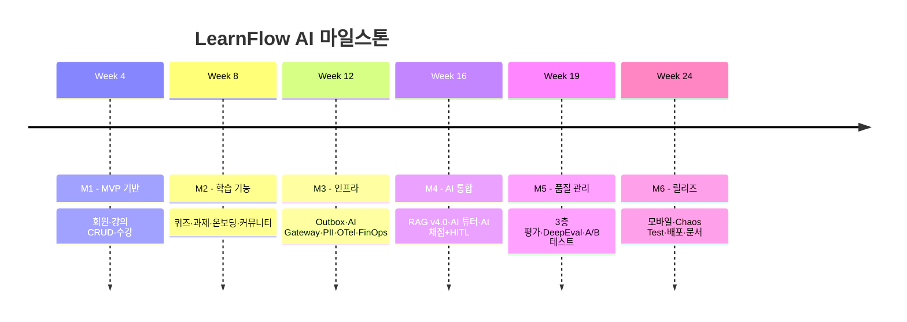
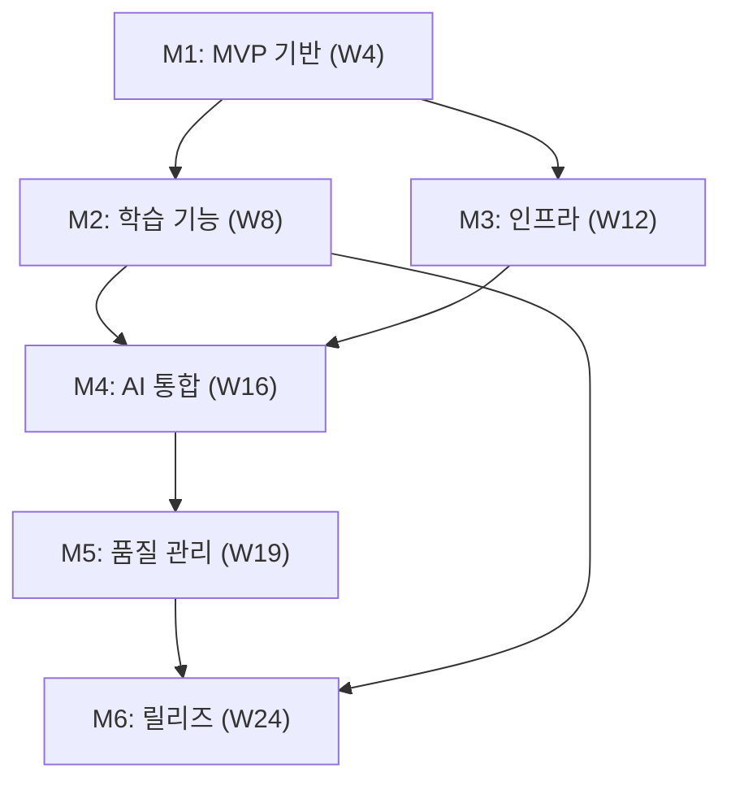

# LearnFlow AI - Phase 로드맵

> **버전**: v4.0
> **작성일**: 2026-04-02
> **원본 문서**: [Project-Control-Hub/documents - 00-스케줄 v4.0](https://github.com/Project-Control-Hub/documents/blob/main/00-스케줄/00-스케줄_v4.0.md)
> **연결 문서**: [TASKS.md](TASKS.md) | [WORKFLOW.md](WORKFLOW.md) | [PRD.md](PRD.md)

---

## Phase 전체 요약

| Phase | 구분 | 기간 | 주차 | 마일스톤 | 상태 |
|-------|------|------|------|----------|------|
| Phase 1 | 기반 구축 | 2026-04-07 ~ 05-04 | Week 1~4 | M1: MVP 기반 | 대기 |
| Phase 2 | 핵심 학습 | 2026-05-05 ~ 06-01 | Week 5~8 | M2: 학습 기능 | 대기 |
| Phase 3 | 이벤트 인프라 + AI 기반 | 2026-06-02 ~ 06-29 | Week 9~12 | M3: 인프라 | 대기 |
| Phase 4 | RAG + AI 튜터 | 2026-06-30 ~ 07-27 | Week 13~16 | M4: AI 통합 | 대기 |
| Phase 5 | 분석 + 품질 관리 | 2026-07-28 ~ 08-17 | Week 17~19 | M5: 품질 관리 | 대기 |
| Phase 6 | 고도화 및 완성 | 2026-08-18 ~ 09-27 | Week 20~24 | M6: 릴리즈 | 대기 |

**총 기간**: 24주 (6개월) / **시작일**: 2026-04-07 / **종료일**: 2026-09-27

---

## 간트차트

```mermaid
gantt
    title LearnFlow AI 24주 개발 일정
    dateFormat  YYYY-MM-DD
    axisFormat  %m/%d

    section Phase 1: 기반 구축
    Week 1: DB설계+엔티티+JWT인증      :p1w1, 2026-04-07, 7d
    Week 2: 강의CRUD+수강신청+파일업로드 :p1w2, 2026-04-14, 7d
    Week 3: 콘텐츠관리(에디터+영상)     :p1w3, 2026-04-21, 7d
    Week 4: React레이아웃+강의목록/상세  :p1w4, 2026-04-28, 7d
    M1: MVP 기반                       :milestone, m1, 2026-05-04, 0d

    section Phase 2: 핵심 학습
    Week 5: 학습진도추적+레슨완료       :p2w5, 2026-05-05, 7d
    Week 6: 퀴즈/과제+채점이의제기UI    :p2w6, 2026-05-12, 7d
    Week 7: 온보딩진단(Bloom+confidence) :p2w7, 2026-05-19, 7d
    Week 8: 커뮤니티(토론,Q&A)         :p2w8, 2026-05-26, 7d
    M2: 학습 기능                      :milestone, m2, 2026-06-01, 0d

    section Phase 3: 이벤트 인프라+AI 기반
    Week 9: Outbox+Kafka+Consumer멱등+DLQ :p3w9, 2026-06-02, 7d
    Week 10: AI Gateway+PII Pipeline v4.0  :p3w10, 2026-06-09, 7d
    Week 11: Distributed Tracing(OTel)     :p3w11, 2026-06-16, 7d
    Week 12: FinOps(UnitEcon+동적라우팅)   :p3w12, 2026-06-23, 7d
    M3: 인프라                          :milestone, m3, 2026-06-29, 0d

    section Phase 4: RAG + AI 튜터
    Week 13: SemanticChunking+pgvector+HybridSearch :p4w13, 2026-06-30, 7d
    Week 14: Reranking+QueryRewrite+Compression     :p4w14, 2026-07-07, 7d
    Week 15: AI튜터(SSE+레벨링+이중메모리)          :p4w15, 2026-07-14, 7d
    Week 16: AI퀴즈+채점(Confidence+HITL)           :p4w16, 2026-07-21, 7d
    M4: AI 통합                                     :milestone, m4, 2026-07-27, 0d

    section Phase 5: 분석 + 품질 관리
    Week 17: 학습분석+concept_mastery+AI추천 :p5w17, 2026-07-28, 7d
    Week 18: 3층평가(RAGAS+DeepEval+Sampling) :p5w18, 2026-08-04, 7d
    Week 19: A/B테스트+프롬프트관리           :p5w19, 2026-08-11, 7d
    M5: 품질 관리                            :milestone, m5, 2026-08-17, 0d

    section Phase 6: 고도화 및 완성
    Week 20: Flutter모바일앱(핵심+AI튜터)    :p6w20, 2026-08-18, 7d
    Week 21: 알림시스템+관리자대시보드        :p6w21, 2026-08-25, 7d
    Week 22: AI전용Grafana(hallucination+RAG) :p6w22, 2026-09-01, 7d
    Week 23: 보안강화+Chaos Testing           :p6w23, 2026-09-08, 7d
    Week 24: 통합테스트+Docker배포+문서화     :p6w24, 2026-09-15, 7d
    M6: 릴리즈                               :milestone, m6, 2026-09-27, 0d
```

---

## Phase 1 — 기반 구축 (Week 1~4)

> **기간**: 2026-04-07 ~ 05-04
> **마일스톤**: M1 — MVP 기반
> **목표**: MVP 기반 인프라 및 핵심 도메인 구축
> **Task**: [TASKS.md - Phase 1](TASKS.md#phase-1--기반-구축-tasks)

### 주차별 산출물

| 주차 | 작업 항목 | 산출물 |
|------|-----------|--------|
| Week 1 | DB 설계 (Outbox 포함), 엔티티 구현, JWT 인증/인가 | ERD 확정, `users`, `outbox_events` 테이블, JWT Filter |
| Week 2 | 강의 CRUD, 수강 신청, 파일 업로드 (MinIO/S3) | `courses`, `sections`, `lessons`, `enrollments` API |
| Week 3 | 콘텐츠 관리 (TipTap 에디터, 영상 업로드/스트리밍) | 레슨 편집기 UI, 영상 스트리밍 API |
| Week 4 | React 레이아웃, 라우팅, 강의 목록/상세 페이지 | Web SPA 기본 화면 완성 |

**M1 완료 기준**: 회원가입/로그인, 강의 CRUD, 수강 신청 정상 동작

---

## Phase 2 — 핵심 학습 (Week 5~8)

> **기간**: 2026-05-05 ~ 06-01
> **마일스톤**: M2 — 학습 기능
> **목표**: 학습 진도, 평가, 온보딩, 커뮤니티 기능 완성
> **Task**: [TASKS.md - Phase 2](TASKS.md#phase-2--핵심-학습-tasks)

### 주차별 산출물

| 주차 | 작업 항목 | 산출물 |
|------|-----------|--------|
| Week 5 | 학습 진도 추적, 레슨 완료 이벤트 (`LessonCompleted`) | `learning_activities`, 진도율 API |
| Week 6 | 퀴즈/과제 시스템, 채점 이의 제기 UI (`GradingAppeal`) | `quizzes`, `assignment_submissions`, Appeal API |
| Week 7 | 온보딩 진단 테스트 (Bloom's 배분 + confidence weight) | `diagnostic_tests`, 진단 API, `confidence_weight` 컬럼 |
| Week 8 | 커뮤니티 (토론 게시판, Q&A) | `posts`, `comments` 테이블, 커뮤니티 UI |

**M2 완료 기준**: 퀴즈 제출/채점, 과제 제출/이의 제기, 진단 테스트, 커뮤니티 정상 동작

---

## Phase 3 — 이벤트 인프라 + AI 기반 (Week 9~12)

> **기간**: 2026-06-02 ~ 06-29
> **마일스톤**: M3 — 인프라
> **목표**: 프로덕션 수준 이벤트 인프라 및 AI 게이트웨이 구축
> **Task**: [TASKS.md - Phase 3](TASKS.md#phase-3--이벤트-인프라--ai-기반-tasks)

### 주차별 산출물

| 주차 | 작업 항목 | 산출물 |
|------|-----------|--------|
| Week 9 | Transactional Outbox + Debezium/Polling + Kafka + Consumer 멱등성 (`dedup_key`) + DLQ | `OutboxPublisher`, Kafka Consumer, DLQ 토픽 |
| Week 10 | AI Gateway + PII Pipeline v4.0 (Input + Output 양방향 + Presidio + KoNLPy) | `PiiMaskingService`, `PiiOutputScanner`, `AiGatewayController` |
| Week 11 | Distributed Tracing (OTel Sampling 10~30%, 에러 100%, Business Context Span) | Zipkin 연동, `TraceContextPropagator`, Grafana 분산 추적 대시보드 |
| Week 12 | FinOps (Unit Economics + 예산 동적 라우팅 + Semantic Cache) | `CostTracking`, `KillSwitch`, `UnitEconomics`, `SemanticResponseCache` |

**M3 완료 기준**: Outbox → Kafka 정상 릴레이, PII 양방향 마스킹, OTel 트레이스 수집, FinOps 대시보드 가동

---

## Phase 4 — RAG + AI 튜터 (Week 13~16)

> **기간**: 2026-06-30 ~ 07-27
> **마일스톤**: M4 — AI 통합
> **목표**: RAG v4.0 파이프라인 및 AI 튜터 완성
> **Task**: [TASKS.md - Phase 4](TASKS.md#phase-4--rag--ai-튜터-tasks)

### 주차별 산출물

| 주차 | 작업 항목 | 산출물 |
|------|-----------|--------|
| Week 13 | Semantic Chunking 하이브리드 + `chunk_hash` (SHA-256) + pgvector + Hybrid Search (Vector + BM25/ES) | `SemanticChunking`, `EmbeddingWorker`, `HybridSearch`, `content_embeddings` |
| Week 14 | Re-ranking (CrossEncoder ms-marco) + Query Rewrite + Context Compression + Chunk Versioning | `Reranking`, `QueryRewrite`, `ContextCompression`, `ChunkVersioning` |
| Week 15 | AI 튜터 SSE 스트리밍 + 3단계 레벨링 + 이중 메모리 (Short/Long-term) | `AiTutorController` SSE, `LevelingService`, `ShortTermMemory`, `LongTermMemory` |
| Week 16 | AI 퀴즈 자동 생성 + AI 채점 (`rubric_coverage` + Confidence Score + HITL) | `AiQuizGenerator`, `AiGrading`, `ConfidenceScorer`, `ManualReviewQueue` |

**M4 완료 기준**: RAG 파이프라인 E2E 동작, AI 튜터 SSE 응답, AI 채점 + Manual Review Queue 정상 동작

---

## Phase 5 — 분석 + 품질 관리 (Week 17~19)

> **기간**: 2026-07-28 ~ 08-17
> **마일스톤**: M5 — 품질 관리
> **목표**: 학습 분석 엔진 및 AI 품질 3층 평가 체계 완성
> **Task**: [TASKS.md - Phase 5](TASKS.md#phase-5--분석--품질-관리-tasks)

### 주차별 산출물

| 주차 | 작업 항목 | 산출물 |
|------|-----------|--------|
| Week 17 | 학습 분석 + `concept_mastery` + AI 추천 + Cold Start 연동 | `WeaknessDetection`, `ConceptMastery`, AI 추천 API, 분석 대시보드 UI |
| Week 18 | 3층 평가 (RAGAS 보조 3회 중앙값 + DeepEval G-Eval/Hallucination + Importance Sampling) | `RagasEvaluation`, `DeepEvalService`, `LlmJudge`, 배치 스케줄러 |
| Week 19 | A/B 테스트 (학습 성과 `mastery_delta` 연동) + 프롬프트 버전 관리 + 롤백 | `AbTestService`, `PromptVersionService`, A/B 테스트 관리 UI |

**M5 완료 기준**: RAGAS + DeepEval 자동 배치 수행, A/B 테스트 생성/종료, 프롬프트 롤백 동작

---

## Phase 6 — 고도화 및 완성 (Week 20~24)

> **기간**: 2026-08-18 ~ 09-27
> **마일스톤**: M6 — 릴리즈
> **목표**: 모바일 앱, 운영 대시보드, 보안 강화, 최종 배포
> **Task**: [TASKS.md - Phase 6](TASKS.md#phase-6--고도화-및-완성-tasks)

### 주차별 산출물

| 주차 | 작업 항목 | 산출물 |
|------|-----------|--------|
| Week 20 | Flutter 3.x 모바일 앱 — 강의 수강, AI 튜터 채팅, 학습 분석 핵심 화면 | Flutter 앱 (Android/iOS), Riverpod 상태 관리 |
| Week 21 | 알림 시스템 (채점 완료, 이의 제기 결과, 비용 경고) + 관리자 대시보드 | `NotificationWorker`, Admin UI, 알림 이력 API |
| Week 22 | AI 전용 Grafana 대시보드 (hallucination rate, RAG latency breakdown, PII, FinOps) | Grafana JSON 패널 — AI Quality / RAG / FinOps / PII / Outbox |
| Week 23 | 보안 강화 (7 Layer 점검) + Chaos Testing (Kafka 다운, PII 대량 입력, 비용 폭주) | Chaos Test 시나리오 5종, 보안 취약점 점검 보고서 |
| Week 24 | 통합 테스트 + Docker Compose 배포 + 최종 문서화 | Docker Compose 전체 스택, 최종 문서 세트, 배포 가이드 |

**M6 완료 기준**: Flutter 앱 빌드 성공, Chaos Test 통과, Docker 배포 완료, 전체 문서화 완료

---

## 마일스톤 요약



| 마일스톤 | 완료 주차 | 완료 기준 | 주요 산출물 |
|----------|-----------|-----------|-------------|
| **M1: MVP 기반** | Week 4 | 회원가입, 강의 CRUD, 수강 신청 | JWT 인증, 강의 API, React 기본 UI |
| **M2: 학습 기능** | Week 8 | 퀴즈, 과제, 온보딩, 커뮤니티 | 채점 이의 제기, Bloom's 진단, 커뮤니티 |
| **M3: 인프라** | Week 12 | Outbox, AI Gateway, PII, OTel, FinOps | 이벤트 인프라 전체, AI 게이트웨이 |
| **M4: AI 통합** | Week 16 | RAG v4.0, AI 튜터, AI 채점+HITL | SSE 스트리밍, Confidence, Manual Queue |
| **M5: 품질 관리** | Week 19 | 3층 평가, DeepEval, A/B 테스트 | RAGAS 배치, 프롬프트 관리 |
| **M6: 릴리즈** | Week 24 | 모바일, Chaos Test, 배포, 문서 | Flutter 앱, Docker 배포, 최종 문서 |

---

## 의존성 다이어그램



---

## 리스크 일정 영향 분석

| 리스크 | 영향 Phase | 대응 |
|--------|-----------|------|
| LLM API 연동 지연 | Phase 4 (W13~16) | Circuit Breaker Fallback으로 Mock 응답 개발 병행 |
| Kafka/Debezium 설정 복잡도 | Phase 3 (W9) | Polling 방식으로 먼저 구현 후 CDC 전환 |
| Flutter 개발 학습 곡선 | Phase 6 (W20) | W19 병행 사전 준비, 핵심 화면 3개로 범위 고정 |
| RAGAS 점수 불안정 | Phase 5 (W18) | 3회 평가 중앙값, DeepEval 병행으로 대체 지표 확보 |
| 24주 일정 지연 | Phase 6 | Phase 6은 버퍼 주차 포함, Phase별 독립 배포 가능 설계 |

---

## 변경 이력

| 버전 | 날짜 | 변경 내용 |
|------|------|-----------|
| v1.0 | 2026-03-22 | PRD 기반 Phase 로드맵 초안 작성 (Project Control Hub) |
| v4.0 | 2026-04-02 | LearnFlow AI 전환: 24주 6Phase 일정, 마일스톤 M1~M6, 간트차트 반영 |
