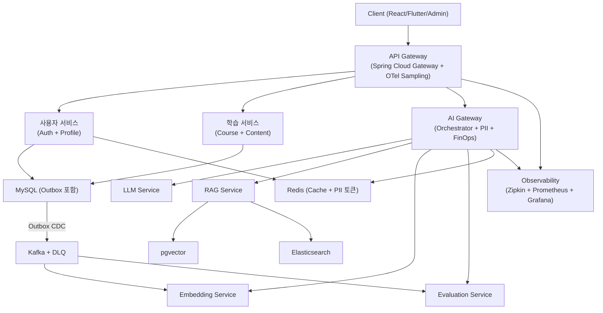

# LearnFlow AI - PRD (Product Requirements Document)

> **버전**: v4.0
> **작성일**: 2026-04-02
> **원본 문서**: [Project-Control-Hub/documents](https://github.com/Project-Control-Hub/documents) — 01-프로젝트계획서 v4.0 + 07-요구사항정의서 v3.0 기반
> **상태**: 확정

---

## 1. 프로젝트 개요

### 1.1 배경 및 목적

기존 LMS(학습 관리 시스템)는 모든 학습자에게 동일한 콘텐츠를 동일한 순서로 제공하는 일방향 구조를 취하고 있다. 학습자의 이해도, 취약점, 학습 속도에 대한 개인화가 부재하여 학습 효율이 낮고, 강사는 수강생 개개인의 학습 상태를 파악하기 어렵다.

LearnFlow AI는 AI/LLM 기술을 접목하여 능동적이고 적응형인 학습 경험을 제공하는 차세대 AI-LMS를 구축한다.

### 1.2 프로젝트 목표 (9개)

| # | 목표 | 핵심 지표 |
|---|------|-----------|
| 1 | **적응형 학습** — 학습자 수준에 맞는 콘텐츠 자동 조정 | `concept_mastery` 향상률 |
| 2 | **AI 튜터** — LLM 기반 실시간 질의응답 및 개념 설명 | 응답 만족도(thumbs-up 비율 >= 75%) |
| 3 | **자동 평가** — AI 퀴즈/과제 자동 생성 및 채점 | Confidence >= 0.8 자동 확정률 |
| 4 | **학습 분석** — 취약점 분석, 학습 패턴 시각화, AI 추천 | 추천 클릭률 |
| 5 | **협업 학습** — 스터디 그룹, 토론, 피어 리뷰 | DAU 커뮤니티 참여율 |
| 6 | **AI 품질 관리** — 3층 평가, A/B 테스트, 지속 개선 | Faithfulness >= 0.85 |
| 7 | **프로덕션 안정성** — Outbox, 분산 추적, Chaos Testing | 이벤트 손실 0건, P95 < 4s |
| 8 | **컴플라이언스** — PII 양방향 보호, 감사 추적 | PII 유출 0건 |
| 9 | **FinOps** — Unit Economics, 동적 라우팅, Semantic Cache | AI 비용/세션 < $0.15 |

### 1.3 프로젝트 범위

| 구분 | 내용 |
|------|------|
| **In-Scope** | JWT 인증/RBAC, 강의 CRUD/수강, AI 튜터(SSE/레벨링/이중메모리), RAG v4.0, AI 퀴즈/채점(Confidence+HITL), 온보딩 진단, 학습분석, Outbox+Kafka, AI Gateway(PII/FinOps), OTel 분산추적, 3층 AI 품질평가, A/B 테스트, Flutter 모바일, 커뮤니티, 알림, Grafana AI 대시보드, Docker Compose 배포, Chaos Testing |
| **Out-of-Scope** | 결제 시스템(Stripe/PG), 라이브 스트리밍, 외부 LMS 데이터 마이그레이션, 앱스토어 배포, 다국어(i18n), 소셜 로그인(OAuth2), Qdrant 전환 실구현 |

### 1.4 대상 사용자

| 역할 | 설명 | 주요 기능 접근 범위 |
|------|------|---------------------|
| **학습자 (Learner)** | 강의를 수강하고 학습하는 최종 사용자 | 강의 수강, AI 튜터 채팅, 퀴즈/과제 제출, 학습 분석, 채점 이의 제기, 온보딩 진단 |
| **강사 (Instructor)** | 강의를 생성하고 관리하는 콘텐츠 제공자 | 강의/섹션/레슨 관리, AI 퀴즈 생성, 과제 출제, 수강생 분석, Manual Review Queue 처리 |
| **관리자 (Admin)** | 시스템 전체를 운영하는 플랫폼 관리자 | 사용자 관리, AI 품질 대시보드, FinOps Kill-switch, OTel 분산 추적, 감사 로그, A/B 테스트, 프롬프트 관리 |

---

## 2. 기술 스택

### 2.1 Backend

| 영역 | 기술 | 버전 | 용도 |
|------|------|------|------|
| Framework | Spring Boot | 4.x | 메인 애플리케이션 서버 |
| Language | Java | 21+ | Virtual Threads (Project Loom) |
| ORM | Spring Data JPA + QueryDSL | 5.x | 데이터 접근 계층 |
| Security | Spring Security | 7.x | JWT 인증/인가, RBAC |
| Build | Gradle | 8.x | Kotlin DSL |
| DB | MySQL | 8.x | Source of Truth |
| Cache | Redis | 7.x | 세션, 캐시, Rate Limiting, PII 토큰 매핑 |
| 메시징 | Apache Kafka | 3.x | 이벤트 기반 비동기 처리 |
| CDC | Debezium | 2.x | Outbox → Kafka 릴레이 (Phase 2) |
| 검색 | Elasticsearch | 8.x | BM25 Hybrid Search |
| 스토리지 | MinIO / AWS S3 | - | 강의 파일, 영상 저장 |
| Resilience | Resilience4j | - | Circuit Breaker, Retry, Rate Limiter |
| Tracing | Micrometer + OpenTelemetry + Zipkin | - | 분산 추적 |
| PII | Presidio + KoNLPy | - | 개인정보 마스킹/역마스킹 |
| DB Migration | Flyway | - | 스키마 버전 관리 |

### 2.2 AI / LLM

| 영역 | 기술 | 용도 |
|------|------|------|
| LLM API (Primary) | Claude API (Anthropic) | 메인 AI 엔진 (Tutor, Quiz, Grading) |
| LLM API (Fallback) | OpenAI GPT API | Circuit Breaker Fallback |
| Embedding | text-embedding-3-small | 콘텐츠 청크 임베딩 |
| Vector DB | pgvector (Phase 1) → Qdrant (Phase 2+) | RAG 벡터 저장 및 검색 |
| Re-ranking | CrossEncoder (ms-marco-MiniLM) | 검색 결과 재정렬 Top 5 |
| RAG 평가 | RAGAS + DeepEval | 자동 품질 평가 (3층 평가 Layer 2) |
| Chunking | Recursive + Semantic Boundary Detection | 의미 경계 보존 청킹 |
| Prompt 관리 | 자체 Template Engine + Version Registry | 프롬프트 버전 관리 및 A/B 테스트 |

### 2.3 Frontend

| 영역 | 기술 | 버전 | 용도 |
|------|------|------|------|
| Web Framework | React | 18.x | SPA 웹 클라이언트 |
| Language | TypeScript | 5.x | 타입 안전성 |
| 상태 관리 | Zustand | 4.x | 전역 상태 |
| API 캐싱 | TanStack Query | 5.x | 서버 상태 캐싱 |
| UI 컴포넌트 | shadcn/ui + Tailwind CSS | - | 디자인 시스템 |
| 차트 | Recharts | 2.x | 학습 분석 시각화 |
| 에디터 | TipTap | 2.x | 마크다운/리치텍스트 강의 편집 |
| Mobile | Flutter | 3.x | 크로스플랫폼 모바일 앱 |
| Mobile 상태 | Riverpod | 2.x | Flutter 상태 관리 |

### 2.4 인프라

| 영역 | 기술 | 용도 |
|------|------|------|
| 컨테이너 | Docker + Docker Compose | 개발/스테이징/배포 |
| CI/CD | GitHub Actions | 자동 빌드, 테스트, 배포 |
| 모니터링 | Prometheus + Grafana | 시스템 + AI + FinOps 메트릭 |
| 분산 추적 | Zipkin (OTel) | 서비스 간 분산 추적 |
| CDC | Debezium | Outbox 이벤트 릴레이 |
| 파일 스토리지 | MinIO (로컬) / AWS S3 (프로덕션) | 강의 콘텐츠 저장 |

---

## 3. 기능 요구사항 (FR)

### 3.1 사용자 및 인증 (FR-AUTH)

| ID | 요구사항 | 우선순위 | Phase |
|----|----------|----------|-------|
| FR-AUTH-01 | 이메일/비밀번호 기반 회원가입 (bcrypt 해싱) | P0 | P1 |
| FR-AUTH-02 | JWT 로그인 — Access Token(15분) + Refresh Token(7일) 발급 | P0 | P1 |
| FR-AUTH-03 | Refresh Token 갱신, Redis 저장, 재사용 감지 시 무효화 | P0 | P1 |
| FR-AUTH-04 | RBAC 3역할: LEARNER / INSTRUCTOR / ADMIN | P0 | P1 |
| FR-AUTH-05 | 프로필 수정 (닉네임, 아바타, 학습 선호도) | P1 | P1 |

### 3.2 강의 관리 (FR-COURSE)

| ID | 요구사항 | 우선순위 | Phase |
|----|----------|----------|-------|
| FR-COURSE-01 | 강의/섹션/레슨 3단계 CRUD | P0 | P1 |
| FR-COURSE-02 | 레슨 타입: 텍스트(TipTap), 영상(URL), 파일 첨부 (MinIO/S3) | P0 | P1 |
| FR-COURSE-03 | 레슨 생성/수정 시 `ContentCreated/Updated` Outbox 이벤트 → Embedding Worker | P1 | P3 |
| FR-COURSE-04 | 수강 신청 + 진도율(%) 실시간 조회 | P0 | P1 |
| FR-COURSE-05 | 레슨 완료 → `LessonCompleted` 이벤트 → Analytics Worker 진도/취약점 갱신 | P1 | P2 |
| FR-COURSE-06 | 비로그인 강의 목록/상세 조회 | P0 | P1 |

### 3.3 AI 튜터 (FR-TUTOR)

| ID | 요구사항 | 우선순위 | Phase |
|----|----------|----------|-------|
| FR-TUTOR-01 | 강의별 AI 채팅 세션 생성 + 자연어 질문 | P0 | P4 |
| FR-TUTOR-02 | SSE 스트리밍 응답 (점진적 텍스트 표시) | P1 | P4 |
| FR-TUTOR-03 | 3단계 레벨링: L1(<0.4 비유/그림), L2(0.4~0.7 코드/원리), L3(>=0.7 구현/트레이드오프) | P1 | P4 |
| FR-TUTOR-04 | Short-term Memory(10턴, Redis TTL 24h) + Long-term Memory(concept_mastery, MySQL) | P1 | P4 |
| FR-TUTOR-05 | RAG course_id 기반 격리 검색 | P1 | P4 |
| FR-TUTOR-06 | 응답 피드백(thumbs-up/down) → 3층 평가 Layer 1 | P1 | P4 |
| FR-TUTOR-07 | 레슨 기반 추천 질문 3개 생성 | P2 | P4 |
| FR-TUTOR-08 | 세션별 대화 히스토리 조회 | P2 | P4 |

### 3.4 RAG 파이프라인 (FR-RAG)

| ID | 요구사항 | 우선순위 | Phase |
|----|----------|----------|-------|
| FR-RAG-01 | Semantic Chunking 하이브리드 (Recursive 200~400토큰 + Semantic Boundary Detection) | P1 | P4 |
| FR-RAG-02 | `chunk_hash`(SHA-256) 동일 내용 재임베딩 스킵 | P1 | P4 |
| FR-RAG-03 | 콘텐츠 삭제 시 Soft Delete (INACTIVE) → 90일 후 물리 삭제 | P1 | P4 |
| FR-RAG-04 | Hybrid Search: pgvector(Top 20) + ES BM25(Top 20) → RRF 융합 | P1 | P4 |
| FR-RAG-05 | Query Rewrite (사용자 질문 → 검색 최적화 쿼리 변환) | P1 | P4 |
| FR-RAG-06 | CrossEncoder Re-ranking → Top 5 선별 | P1 | P4 |
| FR-RAG-07 | Context Compression (핵심 문장 추출, 토큰 40~60% 절감) | P2 | P4 |

### 3.5 퀴즈 및 과제 (FR-QUIZ)

| ID | 요구사항 | 우선순위 | Phase |
|----|----------|----------|-------|
| FR-QUIZ-01 | AI 자동 퀴즈 생성 (bloom_level 포함) | P1 | P4 |
| FR-QUIZ-02 | 퀴즈 제출 → `QuizSubmitted` Outbox → AI Grading Worker | P1 | P2 |
| FR-QUIZ-03 | Confidence Score = weighted(rubric_match 0.3 + determinism 0.25 + consistency 0.25 + rubric_coverage 0.2) | P1 | P4 |
| FR-QUIZ-04 | Confidence >= 0.8 → 자동 확정 / < 0.8 → Manual Review Queue 이관 | P1 | P4 |
| FR-QUIZ-05 | 채점 이의 제기(Appeal, 7일 이내) → `GradingAppeal` → 강사 Queue | P1 | P2 |
| FR-QUIZ-06 | 강사 Manual Review Queue 조회 + 최종 확정 | P1 | P2 |
| FR-QUIZ-07 | 퀴즈 결과 + AI 피드백 조회 | P1 | P2 |
| FR-QUIZ-08 | 과제 자유 텍스트 제출 → `AssignmentSubmitted` → AI 채점 (`ai_confidence`) | P1 | P2 |

### 3.6 학습 분석 (FR-ANALYTICS)

| ID | 요구사항 | 우선순위 | Phase |
|----|----------|----------|-------|
| FR-ANALYTICS-01 | 학습 대시보드: 주간 학습 시간, 개념별 숙련도, 취약점 맵 | P1 | P5 |
| FR-ANALYTICS-02 | `concept_mastery` + `confidence` 자동 갱신 (퀴즈/레슨 이벤트 기반) | P1 | P5 |
| FR-ANALYTICS-03 | AI 추천 (보충 퀴즈, 관련 레슨) — mastery 낮은 개념 대상 | P1 | P5 |
| FR-ANALYTICS-04 | 개념별 취약점 분석 + 개선 제안 조회 | P1 | P5 |
| FR-ANALYTICS-05 | 누적 학습 시간 + 일별/주별 패턴 | P2 | P5 |
| FR-ANALYTICS-06 | 강사: 강의별 수강생 분석 (진도율, 퀴즈 평균, 취약 개념 Top 5) | P1 | P5 |

### 3.7 온보딩 (FR-ONBOARD)

| ID | 요구사항 | 우선순위 | Phase |
|----|----------|----------|-------|
| FR-ONBOARD-01 | 진단 테스트(3~5분, 5문항, Bloom's 배분) | P1 | P2 |
| FR-ONBOARD-02 | 진단 결과 → 초기 mastery + confidence_weight=0.7 | P1 | P2 |
| FR-ONBOARD-03 | 자가 진단(30초): 입문/초급/중급/고급, confidence_weight=0.3 | P1 | P2 |
| FR-ONBOARD-04 | confidence 낮은 개념 → 빠른 퀴즈 제안 → mastery+confidence 동시 갱신 | P2 | P5 |

### 3.8 AI 품질 관리 (FR-QUALITY)

| ID | 요구사항 | 우선순위 | Phase |
|----|----------|----------|-------|
| FR-QUALITY-01 | 3층 평가: L1(사용자 피드백) + L2(RAGAS 3회 중앙값 + DeepEval + Importance Sampling) + L3(인간 전문가 리뷰) | P1 | P5 |
| FR-QUALITY-02 | RAGAS: Faithfulness, Context Precision, Context Recall, Answer Relevancy | P1 | P5 |
| FR-QUALITY-03 | DeepEval: G-Eval + Hallucination Score / Faithfulness < 0.7 → 자동 리포트 | P1 | P5 |
| FR-QUALITY-04 | Importance Sampling: 저성능 토픽 가중 샘플링 (Haiku 사용) | P2 | P5 |
| FR-QUALITY-05 | A/B 테스트 생성 + RAGAS + mastery_delta 측정 | P1 | P5 |
| FR-QUALITY-06 | 프롬프트 버전 관리 + 즉시 롤백 | P1 | P5 |

### 3.9 FinOps (FR-FINOPS)

| ID | 요구사항 | 우선순위 | Phase |
|----|----------|----------|-------|
| FR-FINOPS-01 | AI 요청별 cost_usd 기록 (서비스, 모델, 토큰, cache_hit) | P1 | P3 |
| FR-FINOPS-02 | Unit Economics: session < $0.15, quiz_gen < $0.05, grading < $0.03 | P1 | P3 |
| FR-FINOPS-03 | Soft Limit($80) → 알림, Hard Limit($150) → Opus 비활성 + Haiku 강제 | P1 | P3 |
| FR-FINOPS-04 | 예산 동적 라우팅: >70% 정상 / 50~70% Opus 비활성 / 30~50% Haiku 우선 / <30% Haiku 전용 | P1 | P3 |
| FR-FINOPS-05 | Semantic Cache: 유사도 > 0.95 재사용, Hit Rate >= 40% | P1 | P3 |
| FR-FINOPS-06 | 이상 패턴 감지 (5분 50회, 동일 질문 10회) → Rate Limit 강화 | P2 | P3 |

### 3.10 PII 개인정보 보호 (FR-PII)

| ID | 요구사항 | 우선순위 | Phase |
|----|----------|----------|-------|
| FR-PII-01 | Input PII 마스킹: Regex(한국 특화) + NER(Presidio + KoNLPy) → 토큰 치환 | P1 | P3 |
| FR-PII-02 | PII 매핑 Redis session-scoped, 세션 종료 시 삭제 | P1 | P3 |
| FR-PII-03 | Output PII 스캔 (v4.0): LLM 생성 PII 감지 → 마스킹 + `OUTPUT_PII_DETECTED` 감사 로그 | P1 | P3 |
| FR-PII-04 | 한국 PIPA + EU AI Act 준수 (처리 목적, 위탁 고지, AI 생성 명시) | P1 | P3 |
| FR-PII-05 | Pseudonymization(가명화) 옵션 | P2 | P3 |

### 3.11 이벤트 인프라 (FR-EVENT)

| ID | 요구사항 | 우선순위 | Phase |
|----|----------|----------|-------|
| FR-EVENT-01 | Transactional Outbox: 비즈니스 데이터 + outbox_events 동일 트랜잭션 | P1 | P3 |
| FR-EVENT-02 | Outbox 릴레이: Polling + ShedLock (Phase 1) → Debezium CDC (Phase 2) | P1 | P3 |
| FR-EVENT-03 | Consumer 멱등성: dedup_key(aggregate_id + event_type + version) | P1 | P3 |
| FR-EVENT-04 | Outbox 5회 실패 → DEAD_LETTER, Consumer 3회 실패 → DLQ 토픽 | P1 | P3 |
| FR-EVENT-05 | destination_topic 기반 토픽 라우팅 | P1 | P3 |

### 3.12 모니터링 및 분산 추적 (FR-OBS)

| ID | 요구사항 | 우선순위 | Phase |
|----|----------|----------|-------|
| FR-OBS-01 | OTel Sampling: dev 100% / staging 50% / prod 10~30%, 5xx+AI 100% | P1 | P3 |
| FR-OBS-02 | Business Context Span: user.id, course.id, ai.model, ai.cost_usd, rag.*, cache.hit | P1 | P3 |
| FR-OBS-03 | Grafana AI 대시보드: hallucination, confidence, cache_hit, RAG latency, FinOps, PII, Outbox | P2 | P6 |
| FR-OBS-04 | Kafka Consumer Lag Prometheus + Grafana 실시간 모니터링 | P1 | P3 |

### 3.13 기타

| ID | 요구사항 | 우선순위 | Phase |
|----|----------|----------|-------|
| FR-SUMMARY-01 | AI 레슨 요약 (핵심 개념 3가지) | P2 | P4 |
| FR-SUMMARY-02 | AI 플래시카드 자동 생성 (질문/답변 쌍) | P2 | P4 |
| FR-COMMUNITY-01 | 강의별 토론 게시판 CRUD | P2 | P2 |
| FR-COMMUNITY-02 | Q&A 게시판 (질문/답변) | P2 | P2 |
| FR-NOTIFY-01 | 채점/이의제기/Manual Review 완료 알림 | P2 | P6 |
| FR-NOTIFY-02 | FinOps Soft/Hard Limit 관리자 Slack/이메일 알림 | P1 | P3 |

---

## 4. 비기능 요구사항 (NFR)

### 4.1 성능

| ID | 요구사항 | 목표치 |
|----|----------|--------|
| NFR-PERF-01 | 일반 REST API 응답 P95 | < 500ms |
| NFR-PERF-02 | AI 튜터 응답 P95 (RAG 전체 포함) | < 4s |
| NFR-PERF-03 | AI 튜터 SSE 첫 토큰 수신(TTFT) | < 1.5s |
| NFR-PERF-04 | 동시 접속자 (Virtual Threads) | 1,000명 |
| NFR-PERF-05 | Kafka Consumer Lag (정상 상태) | < 100건 |
| NFR-PERF-06 | Semantic Cache Hit Rate | >= 40% |

### 4.2 보안

| ID | 요구사항 | 목표치 |
|----|----------|--------|
| NFR-SEC-01 | HTTPS 전용, JWT Access Token 15분 만료 | 필수 |
| NFR-SEC-02 | 비밀번호 bcrypt (cost factor 12+) | 필수 |
| NFR-SEC-03 | LLM 입력 PII 100% 마스킹, PII 유출 0건 | 0건 |
| NFR-SEC-04 | System Prompt 절대 노출 금지 | 필수 |
| NFR-SEC-05 | SQL Injection, XSS, CSRF 방어 | OWASP ZAP |
| NFR-SEC-06 | 모든 데이터 변경 AOP 감사 로그 | 필수 |
| NFR-SEC-07 | Prompt Injection 7 Layer 방어 | 필수 |

### 4.3 가용성

| ID | 요구사항 | 목표치 |
|----|----------|--------|
| NFR-AVAIL-01 | 시스템 가용성 | >= 99.9% |
| NFR-AVAIL-02 | Circuit Breaker Fallback 전환 시간 | < 5s |
| NFR-AVAIL-03 | Kafka 장애 시 이벤트 손실 | 0건 |
| NFR-AVAIL-04 | DB Read Replica 구성 (프로덕션) | 필수 |

### 4.4 확장성

| ID | 요구사항 |
|----|----------|
| NFR-SCALE-01 | AI 서비스 독립 스케일 아웃 가능 |
| NFR-SCALE-02 | VectorStore 추상화 (pgvector → Qdrant 전환 준비) |
| NFR-SCALE-03 | Kafka Consumer Group 기반 수평 확장 |

### 4.5 유지보수성

| ID | 요구사항 |
|----|----------|
| NFR-MAINT-01 | SpringDoc OpenAPI Swagger UI 자동 생성 |
| NFR-MAINT-02 | Flyway 마이그레이션 스크립트로 DB 스키마 관리 |
| NFR-MAINT-03 | 단위 테스트 >= 70%, 통합 테스트 >= 50% |
| NFR-MAINT-04 | AI 프롬프트 버전 관리 + 즉시 롤백 |

### 4.6 규정 준수

| ID | 요구사항 |
|----|----------|
| NFR-COMP-01 | 한국 PIPA: 처리 목적 명시, 위탁 고지, PII 처리 유형 기록 |
| NFR-COMP-02 | EU AI Act: AI 생성 결과 명시 `[AI 생성]`, 감사 추적 |
| NFR-COMP-03 | PII 보관 기간: 세션 종료 시 마스킹 토큰 즉시 삭제, Soft Delete 90일 후 물리 삭제 |

---

## 5. 시스템 아키텍처 개요

### 핵심 패턴

| 패턴 | 적용 위치 | 목적 |
|------|-----------|------|
| Transactional Outbox | 학습/퀴즈/과제 서비스 | 이벤트 무손실 발행 |
| Consumer 멱등성 (dedup_key) | 모든 Kafka Consumer | 중복 처리 방지 |
| Circuit Breaker (Resilience4j) | AI Gateway | LLM API 장애 격리 |
| PII 양방향 마스킹 | AI Gateway | 개인정보 보호 (Input + Output) |
| Semantic Cache | AI Gateway | LLM 비용 40~60% 절감 |
| OTel Distributed Tracing | API Gateway → 전 서비스 | 서비스 간 추적 |

---

## 6. 보안 설계 — 7 Layer

| Layer | 항목 | 구현 |
|-------|------|------|
| Layer 1 | 입력 필터링 | 길이 제한 + 위험 패턴 감지 (SQL Injection, XSS) |
| Layer 2 | PII Masking | Input + Output 양방향 스캔 (Presidio + KoNLPy + Regex) |
| Layer 3 | System Prompt 격리 | 절대 노출 금지, 별도 Template Registry 관리 |
| Layer 4 | Output Validation | 점수 범위 검증, JSON 스키마 검증, 이상값 필터링 |
| Layer 5 | 데이터 격리 | course_id 기반 RAG 검색 범위 제한 |
| Layer 6 | Tool 사용 제한 | DB 직접 조회 차단, 외부 URL 차단, 파일 시스템 차단 |
| Layer 7 | FinOps Kill-switch | Soft/Hard 한도 초과 시 자동 다운그레이드 + Admin 수동 해제 |

---

## 7. 팀 구성

| 역할 | 인원 | 담당 영역 |
|------|------|-----------|
| Backend Engineer | 2명 | Spring Boot, Kafka, DB, Outbox, OTel |
| AI/ML Engineer | 1명 | AI Gateway, RAG, Embedding, PII, FinOps |
| Frontend Engineer | 1명 | React Web, 학습 분석 UI, 관리자 대시보드 |
| Mobile Engineer | 1명 | Flutter 3.x 앱 (Phase 6) |
| DevOps Engineer | 1명 | Docker, CI/CD, Prometheus, Grafana, Chaos Test |
| QA Engineer | 1명 | 통합 테스트, Chaos Test, 보안 점검 |
| **합계** | **7명** | |

---

## 8. 리스크 매트릭스

| 리스크 | 영향도 | 발생 가능성 | 대응 방안 |
|--------|--------|-------------|-----------|
| LLM API 장애 | 높음 | 중간 | Circuit Breaker + OpenAI Fallback 자동 전환 |
| API 비용 폭증 | 높음 | 중간 | FinOps Kill-switch + Unit Economics + 동적 라우팅 + Semantic Cache |
| Prompt Injection | 높음 | 중간 | 7 Layer 다층 방어 |
| PII 유출 (Output) | 높음 | 낮음 | Output PII 스캔 (v4.0) + 감사 로그 |
| Kafka 브로커 장애 | 높음 | 낮음 | Transactional Outbox DB 안전 저장 → DLQ 복구 |
| 할루시네이션 | 높음 | 중간 | 3층 평가 (RAGAS + DeepEval + 인간) + Importance Sampling |
| RAGAS 점수 불안정 | 중간 | 중간 | 3회 평가 중앙값 + DeepEval 병행 + 인간 보정 |
| AI 채점 분쟁 | 중간 | 중간 | Confidence (rubric_coverage 포함) + Appeal + Manual Queue |
| 콜드 스타트 | 중간 | 중간 | 온보딩 진단 (Bloom's 배분 + confidence weight) |
| 24주 일정 지연 | 중간 | 낮음 | Phase 6 버퍼 주차 + Phase별 독립 배포 가능 설계 |

---

## 9. 성공 기준 (KPI)

| 카테고리 | 지표 | 목표값 |
|----------|------|--------|
| AI 품질 | Faithfulness (RAGAS) | >= 0.85 |
| AI 품질 | 사용자 만족도 (thumbs-up 비율) | >= 75% |
| AI 품질 | Hallucination Rate (DeepEval) | <= 10% |
| 성능 | AI 튜터 응답 P95 | < 4s |
| 성능 | 일반 API P95 | < 500ms |
| 성능 | 동시접속 지원 | 1,000명 |
| FinOps | AI 비용/튜터 세션 | < $0.15 |
| FinOps | Semantic Cache Hit Rate | >= 40% |
| 안정성 | 이벤트 손실 | 0건 |
| 안정성 | 서비스 가용성 | >= 99.9% |
| 보안 | PII 유출 | 0건 |
| 보안 | Chaos Test 통과 | 5개 시나리오 100% |

---

## 10. 요구사항 통계

| 구분 | 분류 | 개수 |
|------|------|------|
| 기능 요구사항 (FR) | AUTH 5 + COURSE 6 + TUTOR 8 + RAG 7 + QUIZ 8 + ANALYTICS 6 + ONBOARD 4 + SUMMARY 2 + QUALITY 6 + FINOPS 6 + PII 5 + EVENT 5 + OBS 4 + COMMUNITY 2 + NOTIFY 2 | **76** |
| 비기능 요구사항 (NFR) | PERF 6 + SEC 7 + AVAIL 4 + SCALE 3 + MAINT 4 + COMP 3 | **27** |
| **전체 합계** | | **103** |

---

## 변경 이력

| 버전 | 날짜 | 변경 내용 |
|------|------|-----------|
| v1.0 | 2026-03-22 | jira-doc 기반 PRD 초안 작성 (Project Control Hub) |
| v4.0 | 2026-04-02 | LearnFlow AI 전환: 프로젝트계획서 v4.0 + 요구사항정의서 v3.0 기반 전면 개정 (FR 76개, NFR 27개, 총 103개) |
