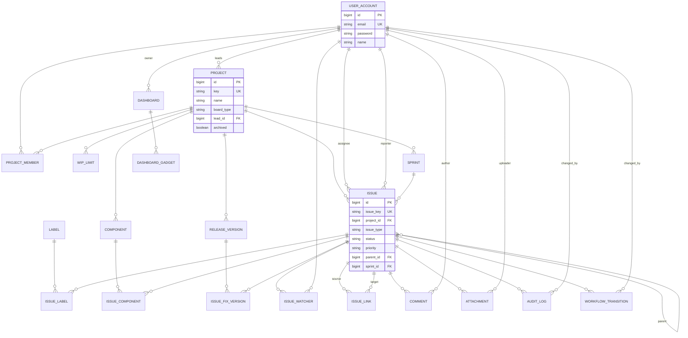

# ERD (논리) — 구현 스키마 v1

> **작성일**: 2026-04-09  
> **Task**: T-200  
> **물리 DDL**: [DDL-mysql-v1.sql](DDL-mysql-v1.sql)  
> **정본 비교**: 외부 `02-ERD_v4.0.md` — `BOARD` 테이블 분리 등 차이는 마이그레이션 백로그로 관리

## 엔티티 관계 (Mermaid)

## 테이블 목록 (20)

| 논리명 | 물리 테이블 |
|--------|-------------|
| 사용자 | `user_account_tb` |
| 프로젝트 | `project_tb` |
| 프로젝트 멤버 | `project_member_tb` |
| 컴포넌트 | `component_tb` |
| WIP 제한 | `wip_limit_tb` |
| 스프린트 | `sprint_tb` |
| 릴리즈 버전 | `release_version_tb` |
| 이슈 | `issue_tb` |
| 이슈–레이블 | `issue_label_tb` |
| 이슈–컴포넌트 | `issue_component_tb` |
| 이슈–수정 버전 | `issue_fix_version_tb` |
| 이슈 워처 | `issue_watcher_tb` |
| 이슈 링크 | `issue_link_tb` |
| 레이블 | `label_tb` |
| 댓글 | `comment_tb` |
| 첨부 | `attachment_tb` |
| 감사 로그 | `audit_log_tb` |
| 워크플로 전환 | `workflow_transition_tb` |
| 대시보드 | `dashboard_tb` |
| 대시보드 가젯 | `dashboard_gadget_tb` |
