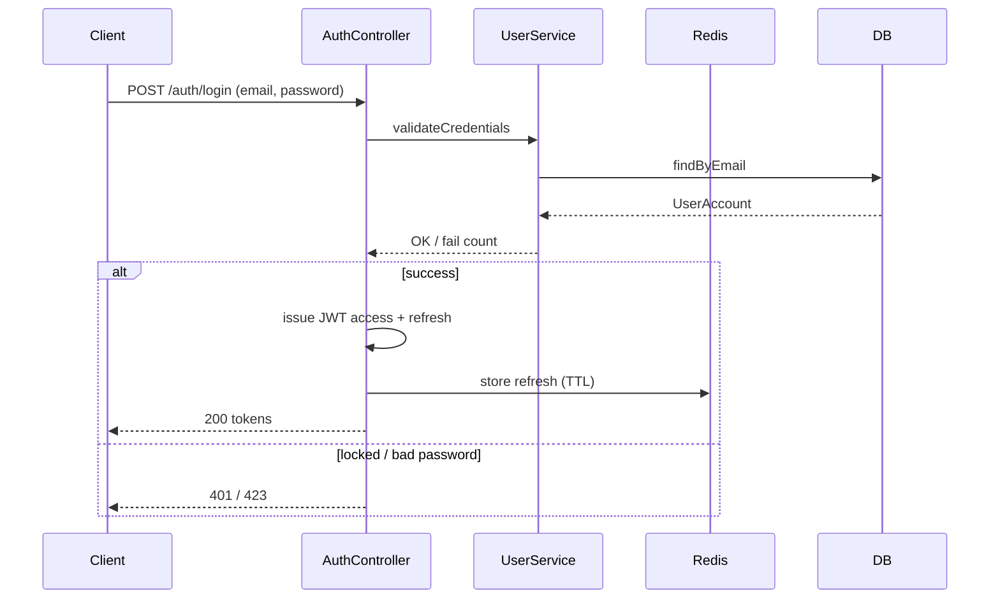
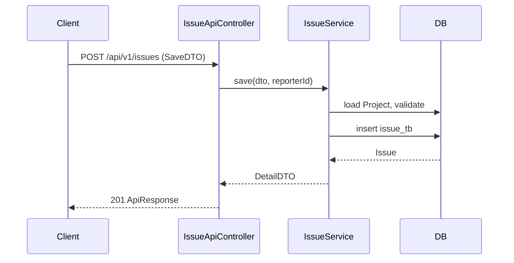
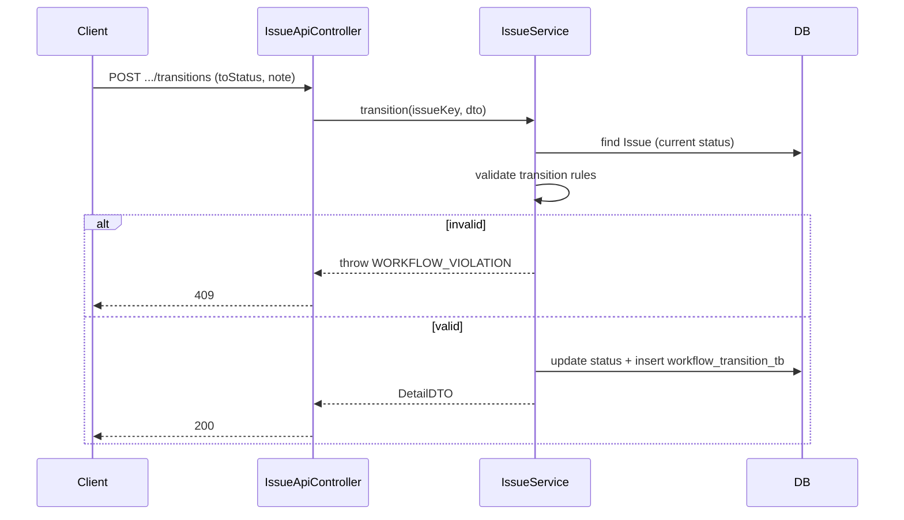
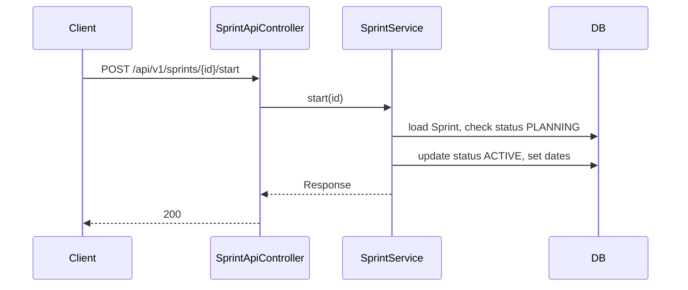
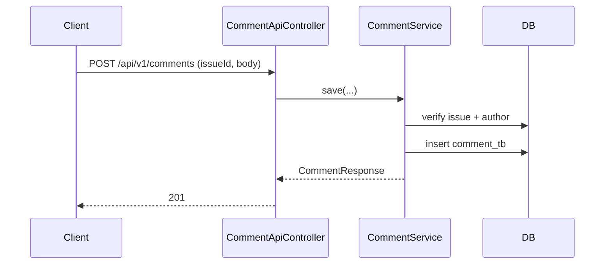

# 시퀀스 다이어그램 (주요 흐름 5개)

> **작성일**: 2026-04-09  
> **Task**: T-202

---

## 1. 로그인 · 액세스 토큰 발급 (Phase 3 목표)

```mermaid
sequenceDiagram
    participant C as Client
    participant A as AuthController
    participant S as UserService
    participant R as Redis
    participant DB as DB

    C->>A: POST /auth/login (email, password)
    A->>S: validateCredentials
    S->>DB: findByEmail
    DB-->>S: UserAccount
    S-->>A: OK / fail count
    alt success
        A->>A: issue JWT access + refresh
        A->>R: store refresh (TTL)
        A-->>C: 200 tokens
    else locked / bad password
        A-->>C: 401 / 423
    end
```

---

## 2. 이슈 생성

```mermaid
sequenceDiagram
    participant C as Client
    participant I as IssueApiController
    participant S as IssueService
    participant DB as DB

    C->>I: POST /api/v1/issues (SaveDTO)
    I->>S: save(dto, reporterId)
    S->>DB: load Project, validate
    S->>DB: insert issue_tb
    DB-->>S: Issue
    S-->>I: DetailDTO
    I-->>C: 201 ApiResponse
```

---

## 3. 워크플로 상태 전환

```mermaid
sequenceDiagram
    participant C as Client
    participant I as IssueApiController
    participant S as IssueService
    participant DB as DB

    C->>I: POST .../transitions (toStatus, note)
    I->>S: transition(issueKey, dto)
    S->>DB: find Issue (current status)
    S->>S: validate transition rules
    alt invalid
        S-->>I: throw WORKFLOW_VIOLATION
        I-->>C: 409
    else valid
        S->>DB: update status + insert workflow_transition_tb
        S-->>I: DetailDTO
        I-->>C: 200
    end
```

---

## 4. 스프린트 시작

```mermaid
sequenceDiagram
    participant C as Client
    participant Sp as SprintApiController
    participant S as SprintService
    participant DB as DB

    C->>Sp: POST /api/v1/sprints/{id}/start
    Sp->>S: start(id)
    S->>DB: load Sprint, check status PLANNING
    S->>DB: update status ACTIVE, set dates
    S-->>Sp: Response
    Sp-->>C: 200
```

---

## 5. 댓글 작성

```mermaid
sequenceDiagram
    participant C as Client
    participant Co as CommentApiController
    participant S as CommentService
    participant DB as DB

    C->>Co: POST /api/v1/comments (issueId, body)
    Co->>S: save(...)
    S->>DB: verify issue + author
    S->>DB: insert comment_tb
    S-->>Co: CommentResponse
    Co-->>C: 201
```
