# LearnFlow AI - ERD (Entity Relationship Diagram)

> **버전**: v4.0
> **기준 문서**: [PRD.md](../PRD.md) | [CLAUDE.md](../../CLAUDE.md)

---

## 전체 ERD

```mermaid
erDiagram
    %% === 사용자 ===
    users {
        bigint id PK
        varchar email UK
        varchar password
        varchar name
        enum role "LEARNER, INSTRUCTOR, ADMIN"
        varchar profile_image
        json learning_preferences
        boolean is_locked
        int failed_login_count
        datetime locked_until
        datetime created_at
        datetime updated_at
    }

    %% === 강의 구조 ===
    courses {
        bigint id PK
        bigint instructor_id FK
        varchar title
        text description
        enum level "BEGINNER, INTERMEDIATE, ADVANCED"
        enum status "DRAFT, PUBLISHED, ARCHIVED"
        varchar thumbnail
        datetime created_at
        datetime updated_at
    }

    sections {
        bigint id PK
        bigint course_id FK
        varchar title
        int order_index
        datetime created_at
        datetime updated_at
    }

    lessons {
        bigint id PK
        bigint section_id FK
        varchar title
        enum type "TEXT, VIDEO, ATTACHMENT"
        text content
        varchar video_url
        int order_index
        int duration_minutes
        datetime created_at
        datetime updated_at
    }

    enrollments {
        bigint id PK
        bigint user_id FK
        bigint course_id FK
        int progress
        enum status "ACTIVE, COMPLETED, DROPPED"
        datetime completed_at
        datetime created_at
        datetime updated_at
    }

    %% === AI 튜터 ===
    ai_chat_sessions {
        bigint id PK
        bigint user_id FK
        bigint course_id FK
        varchar model_used
        enum status "ACTIVE, CLOSED"
        datetime created_at
        datetime updated_at
    }

    ai_chat_messages {
        bigint id PK
        bigint session_id FK
        enum role "USER, ASSISTANT, SYSTEM"
        text content
        varchar model_used
        int input_tokens
        int output_tokens
        decimal cost_usd
        enum feedback "THUMBS_UP, THUMBS_DOWN, null"
        datetime created_at
    }

    %% === 퀴즈 ===
    quizzes {
        bigint id PK
        bigint course_id FK
        bigint lesson_id FK
        varchar title
        enum type "MULTIPLE_CHOICE, SHORT_ANSWER, CODE"
        boolean ai_generated
        datetime created_at
        datetime updated_at
    }

    quiz_questions {
        bigint id PK
        bigint quiz_id FK
        text question_text
        json options
        varchar correct_answer
        text explanation
        int order_index
        datetime created_at
    }

    quiz_attempts {
        bigint id PK
        bigint quiz_id FK
        bigint user_id FK
        int score
        json answers
        text ai_feedback
        datetime created_at
    }

    %% === 과제 ===
    assignments {
        bigint id PK
        bigint course_id FK
        bigint lesson_id FK
        varchar title
        text description
        text rubric
        datetime due_date
        datetime created_at
        datetime updated_at
    }

    assignment_submissions {
        bigint id PK
        bigint assignment_id FK
        bigint user_id FK
        text content
        varchar file_url
        int ai_score
        double ai_confidence
        text ai_feedback
        enum status "SUBMITTED, AI_GRADED, CONFIRMED, APPEALED, MANUAL_REVIEW"
        datetime created_at
        datetime updated_at
    }

    %% === 학습 분석 ===
    concept_mastery {
        bigint id PK
        bigint user_id FK
        bigint course_id FK
        varchar concept_name
        double mastery_score
        double confidence
        enum source "DIAGNOSTIC, QUIZ, ASSIGNMENT, MANUAL"
        datetime created_at
        datetime updated_at
    }

    diagnostic_results {
        bigint id PK
        bigint user_id FK
        bigint course_id FK
        enum diagnosed_level "BEGINNER, INTERMEDIATE, ADVANCED"
        json concept_scores
        double confidence_weight
        datetime created_at
    }

    %% === RAG / 임베딩 ===
    content_embeddings {
        bigint id PK
        bigint lesson_id FK
        bigint course_id FK
        text chunk_text
        vector embedding "VECTOR(1536)"
        varchar chunk_hash "SHA-256"
        enum status "ACTIVE, INACTIVE"
        int version
        datetime created_at
        datetime updated_at
    }

    %% === 이벤트 / Outbox ===
    outbox_events {
        bigint id PK
        varchar event_type
        varchar destination_topic
        text payload
        varchar dedup_key UK
        enum status "PENDING, SENT, DEAD_LETTER"
        int retry_count
        datetime created_at
        datetime sent_at
    }

    %% === FinOps ===
    ai_cost_logs {
        bigint id PK
        varchar service
        varchar model
        int input_tokens
        int output_tokens
        decimal cost_usd
        boolean cache_hit
        varchar trace_id
        datetime created_at
    }

    cost_thresholds {
        bigint id PK
        varchar period "DAILY, MONTHLY"
        decimal soft_limit
        decimal hard_limit
        boolean is_killed
        datetime created_at
        datetime updated_at
    }

    %% === AI 품질 ===
    ragas_evaluations {
        bigint id PK
        varchar evaluation_type
        double faithfulness
        double context_precision
        double context_recall
        double answer_relevancy
        int run_number "3회 중앙값"
        datetime created_at
    }

    prompt_versions {
        bigint id PK
        varchar name
        int version
        text template
        boolean is_active
        json metadata
        datetime created_at
        datetime updated_at
    }

    %% === 커뮤니티 ===
    posts {
        bigint id PK
        bigint user_id FK
        bigint course_id FK
        varchar title
        text content
        enum type "DISCUSSION, QNA"
        datetime created_at
        datetime updated_at
    }

    comments {
        bigint id PK
        bigint post_id FK
        bigint user_id FK
        text content
        bigint parent_id FK "자기참조"
        datetime created_at
        datetime updated_at
    }

    %% === 관계 ===
    users ||--o{ courses : "instructs"
    users ||--o{ enrollments : "enrolls"
    courses ||--o{ enrollments : "has"
    courses ||--o{ sections : "contains"
    sections ||--o{ lessons : "contains"

    users ||--o{ ai_chat_sessions : "owns"
    courses ||--o{ ai_chat_sessions : "context"
    ai_chat_sessions ||--o{ ai_chat_messages : "contains"

    courses ||--o{ quizzes : "has"
    lessons ||--o{ quizzes : "linked"
    quizzes ||--o{ quiz_questions : "contains"
    quizzes ||--o{ quiz_attempts : "attempted"
    users ||--o{ quiz_attempts : "takes"

    courses ||--o{ assignments : "has"
    lessons ||--o{ assignments : "linked"
    assignments ||--o{ assignment_submissions : "submitted"
    users ||--o{ assignment_submissions : "submits"

    users ||--o{ concept_mastery : "tracks"
    courses ||--o{ concept_mastery : "scope"
    users ||--o{ diagnostic_results : "diagnosed"
    courses ||--o{ diagnostic_results : "scope"

    lessons ||--o{ content_embeddings : "embedded"
    courses ||--o{ content_embeddings : "scope"

    users ||--o{ posts : "writes"
    courses ||--o{ posts : "in"
    posts ||--o{ comments : "has"
    users ||--o{ comments : "writes"
    comments ||--o{ comments : "replies"
```

---

## 도메인별 테이블 요약

### 핵심 도메인

| 테이블 | 역할 | 핵심 컬럼 |
|--------|------|-----------|
| `users` | 사용자 (학습자/강사/관리자) | role, is_locked, learning_preferences |
| `courses` | 강의 | instructor_id, level, status |
| `sections` | 강의 섹션 | course_id, order_index |
| `lessons` | 레슨 | section_id, type (TEXT/VIDEO/ATTACHMENT) |
| `enrollments` | 수강 | user_id, course_id, progress, status |

### AI 도메인

| 테이블 | 역할 | 핵심 컬럼 |
|--------|------|-----------|
| `ai_chat_sessions` | AI 튜터 세션 | user_id, course_id, model_used |
| `ai_chat_messages` | AI 대화 메시지 | role, model_used, feedback, cost_usd |
| `content_embeddings` | RAG 벡터 | embedding(VECTOR 1536), chunk_hash, version |
| `ai_cost_logs` | FinOps 비용 | service, model, tokens, cost_usd, cache_hit |
| `cost_thresholds` | Kill-switch | soft_limit, hard_limit, is_killed |
| `prompt_versions` | 프롬프트 관리 | name, version, template, is_active |
| `ragas_evaluations` | RAG 품질 | faithfulness, context_precision, run_number |

### 평가 도메인

| 테이블 | 역할 | 핵심 컬럼 |
|--------|------|-----------|
| `quizzes` | 퀴즈 | type, ai_generated |
| `quiz_questions` | 퀴즈 문제 | options(JSON), correct_answer |
| `quiz_attempts` | 퀴즈 시도 | score, answers(JSON), ai_feedback |
| `assignments` | 과제 | rubric, due_date |
| `assignment_submissions` | 과제 제출 | ai_confidence, status(SUBMITTED→CONFIRMED) |
| `concept_mastery` | 개념 숙련도 | mastery_score, confidence, source |
| `diagnostic_results` | 온보딩 진단 | diagnosed_level, confidence_weight |

### 인프라

| 테이블 | 역할 | 핵심 컬럼 |
|--------|------|-----------|
| `outbox_events` | Transactional Outbox | destination_topic, dedup_key(UNIQUE), status |

### 커뮤니티

| 테이블 | 역할 | 핵심 컬럼 |
|--------|------|-----------|
| `posts` | 게시글 (토론/Q&A) | type (DISCUSSION/QNA) |
| `comments` | 댓글 | parent_id (자기참조, 대댓글) |
