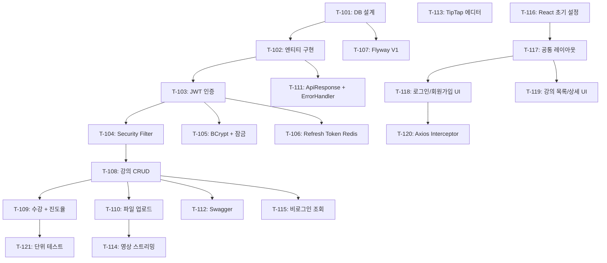

# Phase 1 — 기반 구축 (Week 1~4) Task Workflows

> **기간**: 2026-04-07 ~ 05-04
> **마일스톤**: M1 — MVP 기반
> **Task 수**: 21개 (T-101 ~ T-121)
> **연결 문서**: [TASKS.md](../TASKS.md) | [PHASE.md](../PHASE.md) | [README.md](README.md)

---

## Week 1: DB 설계 + 엔티티 + JWT 인증

---

### T-101: DB 설계 (ERD 확정, Outbox 테이블 포함)

> **담당**: Backend | **선행**: - | **관련 FR**: -

#### 서브 스텝

1. **핵심 도메인 ERD 작성**
   - 파일: `docs/erd/learnflow-erd.md` (Mermaid erDiagram)
   - `users`, `courses`, `sections`, `lessons`, `enrollments` 테이블 설계
   - 사용자 역할은 `role` ENUM (`LEARNER`, `INSTRUCTOR`, `ADMIN`)
   - `courses` → `sections` → `lessons` 3단 계층 구조 (1:N:N)

2. **Outbox 이벤트 테이블 설계**
   - 테이블: `outbox_events`
   - 필수 컬럼: `id`, `event_type`, `payload`(JSON), `destination_topic`, `dedup_key`(UNIQUE), `status`(PENDING/PUBLISHED/DEAD_LETTER), `created_at`, `published_at`, `retry_count`
   - `dedup_key`에 UNIQUE 인덱스 설정

3. **공통 컬럼 정의**
   - 모든 테이블에 `created_at`, `updated_at` (BaseTimeEntity 패턴)
   - Soft Delete가 필요한 테이블에 `deleted_at` nullable 컬럼

4. **인덱스 전략 수립**
   - `users.email` UNIQUE, `enrollments(user_id, course_id)` UNIQUE
   - `outbox_events.status` 인덱스 (Relay 폴링 대상 조회용)
   - `lessons.section_id` + `order_index` 복합 인덱스

#### 완료 기준

- [ ] ERD 문서가 모든 Phase 1 테이블을 포함하고 관계가 명확히 정의됨
- [ ] `outbox_events` 테이블에 `dedup_key` UNIQUE 제약, `destination_topic` 컬럼 존재
- [ ] 팀 리뷰 후 ERD 확정 완료

#### 규칙 체크리스트

- [ ] 수동 DDL 실행 금지 — ERD 확정 후 Flyway 마이그레이션으로만 적용 (T-107)

---

### T-102: 엔티티 구현 (users, courses, sections, lessons, enrollments, outbox_events)

> **담당**: Backend | **선행**: T-101 | **관련 FR**: -

#### 서브 스텝

1. **BaseTimeEntity 추상 클래스 생성**
   - 파일: `learnflow-api/src/main/java/com/learnflow/global/common/BaseTimeEntity.java`
   - `@MappedSuperclass` + `@EntityListeners(AuditingEntityListener.class)`
   - `createdAt`, `updatedAt` 필드 (`@CreatedDate`, `@LastModifiedDate`)

2. **User 엔티티**
   - 파일: `learnflow-api/src/main/java/com/learnflow/domain/user/entity/User.java`
   - 필드: `id`, `email`, `password`, `name`, `role`(ENUM), `isLocked`, `failedLoginAttempts`, `lockedUntil`
   - 비즈니스 메서드: `incrementFailedAttempts()`, `lock(Duration)`, `resetFailedAttempts()`
   - `@Setter` 사용 금지 — 상태 변경은 비즈니스 메서드로만

3. **Course / Section / Lesson 엔티티**
   - 파일: `learnflow-api/src/main/java/com/learnflow/domain/course/entity/Course.java`
   - 파일: `learnflow-api/src/main/java/com/learnflow/domain/course/entity/Section.java`
   - 파일: `learnflow-api/src/main/java/com/learnflow/domain/course/entity/Lesson.java`
   - `Course` → `Section` (1:N, `@OneToMany cascade`)
   - `Section` → `Lesson` (1:N, `orderIndex` 필드로 정렬)
   - `Lesson`에 `contentType` ENUM (`TEXT`, `VIDEO`, `FILE`)

4. **Enrollment 엔티티**
   - 파일: `learnflow-api/src/main/java/com/learnflow/domain/course/entity/Enrollment.java`
   - 필드: `id`, `user`(ManyToOne), `course`(ManyToOne), `progress`(0~100), `status`(ENUM: ACTIVE, COMPLETED, DROPPED)
   - `(user_id, course_id)` 복합 유니크 제약

5. **OutboxEvent 엔티티**
   - 파일: `learnflow-api/src/main/java/com/learnflow/global/event/outbox/OutboxEvent.java`
   - 필드: `id`, `eventType`, `payload`(JSON String), `destinationTopic`, `dedupKey`(UNIQUE), `status`(ENUM), `retryCount`, `createdAt`, `publishedAt`
   - 상태 전이 메서드: `markPublished()`, `incrementRetry()`, `markDeadLetter()`

6. **JPA Repository 인터페이스 생성**
   - 파일: `learnflow-api/src/main/java/com/learnflow/domain/user/repository/UserRepository.java`
   - 파일: `learnflow-api/src/main/java/com/learnflow/domain/course/repository/CourseRepository.java`
   - 파일: `learnflow-api/src/main/java/com/learnflow/domain/course/repository/EnrollmentRepository.java`
   - 파일: `learnflow-api/src/main/java/com/learnflow/global/event/outbox/OutboxEventRepository.java`
   - `UserRepository.findByEmail(String email)` 메서드 정의

#### 완료 기준

- [ ] 모든 엔티티에 `@Setter` 없이 비즈니스 메서드로 상태 변경
- [ ] `BaseTimeEntity` 상속하여 `createdAt`, `updatedAt` 자동 관리
- [ ] `OutboxEvent`에 `destinationTopic`, `dedupKey`(UNIQUE) 컬럼 존재
- [ ] JPA Auditing 설정 (`@EnableJpaAuditing`) 완료

#### 규칙 체크리스트

- [ ] 엔티티에 `@Setter` 금지 — 비즈니스 메서드로 상태 변경
- [ ] DTO는 Java record 사용

---

### T-103: JWT 인증 구현 (로그인/회원가입/토큰 갱신)

> **담당**: Backend | **선행**: T-102 | **관련 FR**: FR-AUTH-01~03

#### 서브 스텝

1. **JWT 토큰 Provider 구현**
   - 파일: `learnflow-api/src/main/java/com/learnflow/global/security/JwtTokenProvider.java`
   - Access Token 생성 (만료: 30분), Refresh Token 생성 (만료: 7일)
   - 토큰 파싱, 유효성 검증, Claims 추출 메서드
   - 서명 알고리즘: HS256, Secret Key는 `application.yml`에서 주입

2. **Auth DTO 정의 (record)**
   - 파일: `learnflow-api/src/main/java/com/learnflow/domain/user/dto/SignupRequest.java`
   - 파일: `learnflow-api/src/main/java/com/learnflow/domain/user/dto/LoginRequest.java`
   - 파일: `learnflow-api/src/main/java/com/learnflow/domain/user/dto/TokenResponse.java`
   - 파일: `learnflow-api/src/main/java/com/learnflow/domain/user/dto/TokenRefreshRequest.java`
   - 모든 DTO는 `record` 타입, `@Valid` 어노테이션 적용 가능하도록 Jakarta Validation 추가

3. **AuthService 구현**
   - 파일: `learnflow-api/src/main/java/com/learnflow/domain/user/service/AuthService.java`
   - `signup()`: 이메일 중복 체크 → BCrypt 암호화 → User 저장 → 토큰 발급
   - `login()`: 이메일 조회 → 잠금 확인 → 비밀번호 검증 → 실패 시 카운트 증가 → 성공 시 토큰 발급
   - `refreshToken()`: Refresh Token 유효성 검증 → 새 Access Token 발급

4. **AuthController 구현**
   - 파일: `learnflow-api/src/main/java/com/learnflow/domain/user/controller/AuthController.java`
   - `POST /api/v1/auth/signup` → 회원가입
   - `POST /api/v1/auth/login` → 로그인
   - `POST /api/v1/auth/refresh` → 토큰 갱신
   - 모든 응답은 `ApiResponse<T>` 래핑

#### 완료 기준

- [ ] 회원가입 시 중복 이메일 체크 및 BCrypt 암호화 동작
- [ ] 로그인 성공 시 Access Token + Refresh Token 반환
- [ ] 토큰 갱신 API가 유효한 Refresh Token으로 새 Access Token 발급
- [ ] 모든 DTO가 Java record 타입

#### 규칙 체크리스트

- [ ] DTO는 Java record 사용
- [ ] 공통 응답 `ApiResponse<T>` 래핑
- [ ] 예외는 `ErrorCode` enum으로 관리

---

### T-104: CustomUserDetails + Security Filter Chain

> **담당**: Backend | **선행**: T-103 | **관련 FR**: FR-AUTH-04

#### 서브 스텝

1. **CustomUserDetails 구현**
   - 파일: `learnflow-api/src/main/java/com/learnflow/global/security/CustomUserDetails.java`
   - `UserDetails` 인터페이스 구현
   - `User` 엔티티를 래핑하여 `getAuthorities()`에서 역할(ROLE_LEARNER, ROLE_INSTRUCTOR, ROLE_ADMIN) 반환
   - `isAccountNonLocked()`에서 `user.isLocked()` 상태 반영

2. **CustomUserDetailsService 구현**
   - 파일: `learnflow-api/src/main/java/com/learnflow/global/security/CustomUserDetailsService.java`
   - `UserDetailsService` 구현, `loadUserByUsername(email)` → `UserRepository.findByEmail()`
   - 사용자 미존재 시 `UsernameNotFoundException` throw

3. **JwtAuthenticationFilter 구현**
   - 파일: `learnflow-api/src/main/java/com/learnflow/global/security/JwtAuthenticationFilter.java`
   - `OncePerRequestFilter` 상속
   - `Authorization: Bearer {token}` 헤더에서 토큰 추출 → 검증 → `SecurityContextHolder`에 인증 정보 설정
   - 토큰 없거나 유효하지 않으면 필터 통과 (다음 필터에서 처리)

4. **SecurityConfig 설정**
   - 파일: `learnflow-api/src/main/java/com/learnflow/global/config/SecurityConfig.java`
   - `/api/v1/auth/**` → `permitAll()`
   - `/api/v1/courses/**` GET → `permitAll()` (비로그인 조회)
   - 그 외 → `authenticated()`
   - CORS 설정 (개발: `localhost:3000` 허용)
   - CSRF 비활성화 (REST API)
   - `JwtAuthenticationFilter`를 `UsernamePasswordAuthenticationFilter` 앞에 등록

#### 완료 기준

- [ ] JWT 토큰이 없는 요청은 인증 엔드포인트만 접근 가능
- [ ] 유효한 JWT 토큰으로 인증된 사용자 정보가 `SecurityContext`에 설정됨
- [ ] 역할 기반 접근 제어 (LEARNER, INSTRUCTOR, ADMIN) 동작
- [ ] 잠긴 계정(`isLocked`)은 인증 거부

#### 규칙 체크리스트

- [ ] 공통 응답 `ApiResponse<T>` 래핑 (인증 실패 응답 포함)
- [ ] 예외는 `GlobalExceptionHandler`에서 일괄 처리

---

### T-105: 비밀번호 BCrypt 암호화 + 로그인 실패 잠금

> **담당**: Backend | **선행**: T-103 | **관련 FR**: NFR-SEC-02

#### 서브 스텝

1. **BCrypt PasswordEncoder Bean 등록**
   - 파일: `learnflow-api/src/main/java/com/learnflow/global/config/SecurityConfig.java`
   - `@Bean PasswordEncoder passwordEncoder()` → `BCryptPasswordEncoder(12)` (strength 12)

2. **로그인 실패 카운트 로직 구현**
   - 파일: `learnflow-api/src/main/java/com/learnflow/domain/user/entity/User.java`
   - `incrementFailedAttempts()`: `failedLoginAttempts++`, 5회 도달 시 `lock(Duration.ofMinutes(30))` 호출
   - `lock(Duration)`: `isLocked = true`, `lockedUntil = now + duration`
   - `resetFailedAttempts()`: 로그인 성공 시 카운트 0으로 초기화, `isLocked = false`

3. **AuthService 잠금 검증 로직 추가**
   - 파일: `learnflow-api/src/main/java/com/learnflow/domain/user/service/AuthService.java`
   - `login()` 진입 시 `isLocked && lockedUntil > now` 이면 `ACCOUNT_LOCKED` 에러
   - 잠금 시간 경과 시 자동 해제 (`lockedUntil <= now` 이면 `resetFailedAttempts()`)

4. **ErrorCode 추가**
   - 파일: `learnflow-api/src/main/java/com/learnflow/global/exception/ErrorCode.java`
   - `ACCOUNT_LOCKED(403, "계정이 일시적으로 잠겼습니다.")`
   - `INVALID_CREDENTIALS(401, "이메일 또는 비밀번호가 올바르지 않습니다.")`

#### 완료 기준

- [ ] 비밀번호가 BCrypt로 암호화되어 DB에 저장됨
- [ ] 5회 연속 로그인 실패 시 계정 30분 잠금
- [ ] 잠금 시간 경과 후 자동 해제
- [ ] 로그인 성공 시 실패 카운트 초기화

#### 규칙 체크리스트

- [ ] 엔티티에 `@Setter` 금지 — `lock()`, `resetFailedAttempts()` 비즈니스 메서드 사용
- [ ] 예외는 `ErrorCode` enum으로 관리

---

### T-106: Refresh Token Redis 저장

> **담당**: Backend | **선행**: T-103 | **관련 FR**: FR-AUTH-03

#### 서브 스텝

1. **Redis 설정**
   - 파일: `learnflow-api/src/main/java/com/learnflow/global/config/RedisConfig.java`
   - `@Configuration` + `RedisTemplate<String, String>` Bean 등록
   - `application.yml`에 Redis 호스트/포트 설정 (`spring.data.redis`)

2. **RefreshTokenService 구현**
   - 파일: `learnflow-api/src/main/java/com/learnflow/domain/user/service/RefreshTokenService.java`
   - `save(userId, refreshToken)`: Redis에 `refresh_token:{userId}` → token 저장 (TTL 7일)
   - `findByUserId(userId)`: 저장된 Refresh Token 조회
   - `delete(userId)`: 로그아웃 시 삭제
   - `validate(userId, token)`: 저장된 토큰과 비교 검증

3. **AuthService Refresh Token 연동**
   - 파일: `learnflow-api/src/main/java/com/learnflow/domain/user/service/AuthService.java`
   - `login()` 성공 시 `RefreshTokenService.save()` 호출
   - `refreshToken()` 시 Redis에서 검증 후 새 Access Token 발급
   - 로그아웃 API 추가: `POST /api/v1/auth/logout` → Redis에서 Refresh Token 삭제

4. **AuthController 로그아웃 엔드포인트 추가**
   - 파일: `learnflow-api/src/main/java/com/learnflow/domain/user/controller/AuthController.java`
   - `POST /api/v1/auth/logout` → Refresh Token 삭제, 응답: `ApiResponse<Void>`

#### 완료 기준

- [ ] Refresh Token이 Redis에 TTL 7일로 저장됨
- [ ] 토큰 갱신 시 Redis에 저장된 Refresh Token과 일치해야 갱신 성공
- [ ] 로그아웃 시 Redis에서 Refresh Token 삭제
- [ ] 동일 사용자 재로그인 시 기존 Refresh Token 갱신(덮어쓰기)

#### 규칙 체크리스트

- [ ] Redis 키 패턴: `refresh_token:{userId}` (CLAUDE.md 키 패턴과 일관)
- [ ] 공통 응답 `ApiResponse<T>` 래핑

---

### T-107: Flyway 마이그레이션 V1 (초기 스키마)

> **담당**: Backend | **선행**: T-101 | **관련 FR**: NFR-MAINT-02

#### 서브 스텝

1. **Flyway 의존성 및 설정**
   - 파일: `learnflow-api/build.gradle.kts` — `implementation("org.flywaydb:flyway-mysql")` 추가
   - 파일: `learnflow-api/src/main/resources/application.yml` — `spring.flyway.enabled=true`, `locations=classpath:db/migration`

2. **V1 마이그레이션 파일 작성**
   - 파일: `learnflow-api/src/main/resources/db/migration/V1__init_schema.sql`
   - `users` 테이블: `id`, `email`(UNIQUE), `password`, `name`, `role`(ENUM), `is_locked`, `failed_login_attempts`, `locked_until`, `created_at`, `updated_at`
   - `courses` 테이블: `id`, `title`, `description`, `instructor_id`(FK users), `status`(DRAFT/PUBLISHED), `created_at`, `updated_at`
   - `sections` 테이블: `id`, `course_id`(FK), `title`, `order_index`, `created_at`, `updated_at`
   - `lessons` 테이블: `id`, `section_id`(FK), `title`, `content`(TEXT), `content_type`(ENUM), `order_index`, `created_at`, `updated_at`
   - `enrollments` 테이블: `id`, `user_id`(FK), `course_id`(FK), `progress`(INT DEFAULT 0), `status`(ENUM), `created_at`, `updated_at`, UNIQUE(`user_id`, `course_id`)
   - `outbox_events` 테이블: `id`, `event_type`, `payload`(JSON), `destination_topic`, `dedup_key`(UNIQUE), `status`(ENUM DEFAULT 'PENDING'), `retry_count`(INT DEFAULT 0), `created_at`, `published_at`

3. **인덱스 생성**
   - `idx_outbox_status` ON `outbox_events(status)` — Relay 폴링 성능
   - `idx_enrollment_user` ON `enrollments(user_id)` — 사용자별 수강 조회
   - `idx_lesson_section_order` ON `lessons(section_id, order_index)` — 레슨 정렬 조회

#### 완료 기준

- [ ] `./gradlew bootRun` 시 Flyway가 V1 마이그레이션을 자동 실행
- [ ] 모든 테이블과 인덱스가 ERD(T-101)와 일치
- [ ] `flyway_schema_history` 테이블에 V1 성공 기록 존재
- [ ] `outbox_events`에 `dedup_key` UNIQUE 제약, `destination_topic` 컬럼 존재

#### 규칙 체크리스트

- [ ] Flyway 파일명 규칙: `V{번호}__{설명}.sql`
- [ ] 기존 Flyway 마이그레이션 파일 수정 금지 — 새 버전 파일만 추가
- [ ] 수동 DDL 실행 금지

---

## Week 2: 강의 CRUD + 수강 + 파일 업로드

---

### T-108: 강의/섹션/레슨 CRUD API

> **담당**: Backend | **선행**: T-104 | **관련 FR**: FR-COURSE-01

#### 서브 스텝

1. **Course DTO 정의 (record)**
   - 파일: `learnflow-api/src/main/java/com/learnflow/domain/course/dto/CourseCreateRequest.java`
   - 파일: `learnflow-api/src/main/java/com/learnflow/domain/course/dto/CourseUpdateRequest.java`
   - 파일: `learnflow-api/src/main/java/com/learnflow/domain/course/dto/CourseResponse.java`
   - 파일: `learnflow-api/src/main/java/com/learnflow/domain/course/dto/SectionRequest.java`
   - 파일: `learnflow-api/src/main/java/com/learnflow/domain/course/dto/LessonRequest.java`
   - `@NotBlank`, `@Size` 등 Jakarta Validation 어노테이션 적용

2. **CourseService 구현**
   - 파일: `learnflow-api/src/main/java/com/learnflow/domain/course/service/CourseService.java`
   - CRUD: `createCourse()`, `updateCourse()`, `deleteCourse()`, `getCourse()`, `getCourses()`(페이징)
   - 강의 생성 시 `instructor_id`는 인증된 사용자 ID로 자동 설정
   - 강의 수정/삭제는 본인 강의만 가능 (소유권 검증)

3. **SectionService / LessonService 구현**
   - 파일: `learnflow-api/src/main/java/com/learnflow/domain/course/service/SectionService.java`
   - 파일: `learnflow-api/src/main/java/com/learnflow/domain/course/service/LessonService.java`
   - 섹션/레슨 추가, 수정, 삭제, 순서 변경(`orderIndex` 조정)
   - 계층 구조 유지: Course → Section → Lesson

4. **CourseController 구현**
   - 파일: `learnflow-api/src/main/java/com/learnflow/domain/course/controller/CourseController.java`
   - `POST /api/v1/courses` → 강의 생성 (INSTRUCTOR)
   - `GET /api/v1/courses` → 강의 목록 (PUBLIC, 페이징)
   - `GET /api/v1/courses/{id}` → 강의 상세 (PUBLIC)
   - `PUT /api/v1/courses/{id}` → 강의 수정 (INSTRUCTOR, 소유자)
   - `DELETE /api/v1/courses/{id}` → 강의 삭제 (INSTRUCTOR, 소유자)
   - `POST /api/v1/courses/{id}/sections` → 섹션 추가
   - `POST /api/v1/courses/{courseId}/sections/{sectionId}/lessons` → 레슨 추가

5. **PageResponse 공통 DTO**
   - 파일: `learnflow-api/src/main/java/com/learnflow/global/common/PageResponse.java`
   - `Page<T>` → `PageResponse<T>` 변환 (content, page, size, totalElements, totalPages)

#### 완료 기준

- [ ] 강의/섹션/레슨 CRUD API가 정상 동작
- [ ] INSTRUCTOR 역할만 생성/수정/삭제 가능
- [ ] 강의 소유자만 자신의 강의 수정/삭제 가능
- [ ] 목록 조회 시 페이징 응답 (`PageResponse`) 반환
- [ ] 모든 응답이 `ApiResponse<T>`로 래핑

#### 규칙 체크리스트

- [ ] DTO는 Java record 사용
- [ ] 엔티티에 `@Setter` 금지
- [ ] 공통 응답 `ApiResponse<T>` 래핑
- [ ] 예외는 `ErrorCode` enum + `GlobalExceptionHandler` 처리

---

### T-109: 수강 신청 + 진도율 API

> **담당**: Backend | **선행**: T-108 | **관련 FR**: FR-COURSE-04

#### 서브 스텝

1. **Enrollment DTO 정의**
   - 파일: `learnflow-api/src/main/java/com/learnflow/domain/course/dto/EnrollmentResponse.java`
   - 필드: `enrollmentId`, `courseId`, `courseTitle`, `progress`, `status`, `enrolledAt`

2. **EnrollmentService 구현**
   - 파일: `learnflow-api/src/main/java/com/learnflow/domain/course/service/EnrollmentService.java`
   - `enroll(userId, courseId)`: 중복 수강 체크 → Enrollment 생성 (progress=0, status=ACTIVE)
   - `getMyEnrollments(userId)`: 내 수강 목록 반환
   - `updateProgress(enrollmentId, progress)`: 진도율 업데이트 (0~100 범위 검증)
   - 진도율 100% 도달 시 `status`를 `COMPLETED`로 자동 변경

3. **EnrollmentRepository 쿼리 메서드**
   - 파일: `learnflow-api/src/main/java/com/learnflow/domain/course/repository/EnrollmentRepository.java`
   - `findByUserId(Long userId)` → 사용자 수강 목록
   - `findByUserIdAndCourseId(Long userId, Long courseId)` → 중복 체크
   - `existsByUserIdAndCourseId(Long userId, Long courseId)` → 수강 여부 확인

4. **EnrollmentController 구현**
   - 파일: `learnflow-api/src/main/java/com/learnflow/domain/course/controller/EnrollmentController.java`
   - `POST /api/v1/courses/{courseId}/enroll` → 수강 신청 (LEARNER)
   - `GET /api/v1/enrollments/me` → 내 수강 목록 (AUTHENTICATED)
   - `PATCH /api/v1/enrollments/{id}/progress` → 진도율 업데이트 (LEARNER)

#### 완료 기준

- [ ] 수강 신청 시 중복 수강 방지
- [ ] 진도율 업데이트 시 0~100 범위 검증
- [ ] 진도율 100% 도달 시 자동 COMPLETED 상태 변경
- [ ] 내 수강 목록 조회 정상 동작

#### 규칙 체크리스트

- [ ] DTO는 Java record 사용
- [ ] 엔티티에 `@Setter` 금지 — `Enrollment.updateProgress(int)` 비즈니스 메서드
- [ ] 공통 응답 `ApiResponse<T>` 래핑

---

### T-110: 파일 업로드 (MinIO/S3 연동)

> **담당**: Backend | **선행**: T-108 | **관련 FR**: FR-COURSE-02

#### 서브 스텝

1. **MinIO/S3 설정**
   - 파일: `learnflow-api/src/main/java/com/learnflow/global/config/StorageConfig.java`
   - AWS SDK S3 클라이언트 Bean 등록 (MinIO 호환 엔드포인트 설정)
   - `application.yml`에 `storage.endpoint`, `storage.bucket`, `storage.access-key`, `storage.secret-key` 설정

2. **FileStorageService 구현**
   - 파일: `learnflow-api/src/main/java/com/learnflow/domain/course/service/FileStorageService.java`
   - `upload(MultipartFile file, String directory)`: S3에 파일 업로드, UUID 기반 파일명 생성으로 충돌 방지
   - `getPresignedUrl(String objectKey)`: 임시 다운로드 URL 생성 (만료: 1시간)
   - `delete(String objectKey)`: 파일 삭제
   - 허용 파일 타입/크기 제한 (이미지: 10MB, 문서: 50MB)

3. **FileController 구현**
   - 파일: `learnflow-api/src/main/java/com/learnflow/domain/course/controller/FileController.java`
   - `POST /api/v1/files/upload` → 파일 업로드 (INSTRUCTOR)
   - `GET /api/v1/files/{objectKey}` → Presigned URL 반환 (AUTHENTICATED)
   - 응답: `ApiResponse<FileUploadResponse>` (objectKey, url, size, contentType)

4. **파일 메타데이터 DTO**
   - 파일: `learnflow-api/src/main/java/com/learnflow/domain/course/dto/FileUploadResponse.java`
   - record: `objectKey`, `url`, `size`, `contentType`, `uploadedAt`

#### 완료 기준

- [ ] MinIO에 파일 업로드 및 Presigned URL 발급 정상 동작
- [ ] 파일 타입/크기 제한 동작 (초과 시 에러 응답)
- [ ] UUID 기반 파일명으로 충돌 방지
- [ ] Docker Compose MinIO 서비스와 연동 확인

#### 규칙 체크리스트

- [ ] DTO는 Java record 사용
- [ ] 공통 응답 `ApiResponse<T>` 래핑
- [ ] 예외는 `ErrorCode` enum으로 관리 (FILE_TOO_LARGE, UNSUPPORTED_FILE_TYPE 등)

---

### T-111: 공통 응답 ApiResponse + GlobalExceptionHandler

> **담당**: Backend | **선행**: T-102 | **관련 FR**: -

#### 서브 스텝

1. **ApiResponse 공통 응답 래퍼**
   - 파일: `learnflow-api/src/main/java/com/learnflow/global/common/ApiResponse.java`
   - `record ApiResponse<T>(boolean success, T data, ErrorResponse error)`
   - 정적 팩토리: `ApiResponse.success(T data)`, `ApiResponse.error(ErrorCode code)`
   - `ErrorResponse` record: `code`(String), `message`(String)

2. **ErrorCode enum 정의**
   - 파일: `learnflow-api/src/main/java/com/learnflow/global/exception/ErrorCode.java`
   - HTTP 상태 코드 + 에러 코드 + 메시지 포함
   - 초기 코드: `INVALID_INPUT(400)`, `UNAUTHORIZED(401)`, `FORBIDDEN(403)`, `NOT_FOUND(404)`, `DUPLICATE_EMAIL(409)`, `INTERNAL_ERROR(500)`

3. **BusinessException 커스텀 예외**
   - 파일: `learnflow-api/src/main/java/com/learnflow/global/exception/BusinessException.java`
   - `ErrorCode`를 생성자로 받는 RuntimeException 확장 클래스

4. **GlobalExceptionHandler 구현**
   - 파일: `learnflow-api/src/main/java/com/learnflow/global/exception/GlobalExceptionHandler.java`
   - `@RestControllerAdvice`
   - `BusinessException` 핸들링 → `ApiResponse.error()`
   - `MethodArgumentNotValidException` (Validation 실패) → 필드별 에러 메시지 반환
   - `AccessDeniedException` → 403 응답
   - `Exception` (기타) → 500 Internal Server Error

#### 완료 기준

- [ ] 모든 API 성공 응답이 `{ success: true, data: {...}, error: null }` 형식
- [ ] 모든 API 에러 응답이 `{ success: false, data: null, error: { code, message } }` 형식
- [ ] Validation 실패 시 필드별 에러 메시지 반환
- [ ] 처리되지 않은 예외도 `ApiResponse` 형태로 래핑

#### 규칙 체크리스트

- [ ] `ApiResponse<T>` — 모든 컨트롤러에서 이 형식만 반환
- [ ] 예외는 `GlobalExceptionHandler`에서 일괄 처리
- [ ] `ErrorCode` enum에 HTTP 상태, 코드, 메시지 포함

---

### T-112: Swagger/OpenAPI 설정

> **담당**: Backend | **선행**: T-108 | **관련 FR**: NFR-MAINT-01

#### 서브 스텝

1. **SpringDoc 의존성 추가**
   - 파일: `learnflow-api/build.gradle.kts`
   - `implementation("org.springdoc:springdoc-openapi-starter-webmvc-ui:2.x.x")`

2. **OpenAPI 설정 클래스**
   - 파일: `learnflow-api/src/main/java/com/learnflow/global/config/SwaggerConfig.java`
   - API 타이틀: "LearnFlow AI API", 버전: "v1"
   - JWT Bearer 인증 스키마 등록 (`SecurityScheme` → `bearerAuth`)
   - 서버 URL 설정 (로컬: `http://localhost:8080`)

3. **API 그룹 분리**
   - Public API: `/api/v1/auth/**`, `/api/v1/courses/**` (GET)
   - Learner API: `/api/v1/enrollments/**`, `/api/v1/ai/**`
   - Instructor API: `/api/v1/instructor/**`
   - Admin API: `/api/v1/admin/**`

4. **application.yml Swagger 경로 설정**
   - `springdoc.swagger-ui.path=/swagger-ui.html`
   - `springdoc.api-docs.path=/v3/api-docs`
   - Production 환경에서는 비활성화: `springdoc.swagger-ui.enabled=false` (profile 분리)

#### 완료 기준

- [ ] `http://localhost:8080/swagger-ui.html` 접속 시 Swagger UI 표시
- [ ] JWT Bearer 토큰 입력 후 인증 필요 API 호출 가능
- [ ] API 그룹별로 분류되어 표시

#### 규칙 체크리스트

- [ ] Production 환경에서 Swagger UI 비활성화 설정 존재

---

## Week 3: 콘텐츠 관리

---

### T-113: TipTap 에디터 기반 레슨 편집 UI

> **담당**: Frontend | **선행**: - | **관련 FR**: FR-COURSE-02

#### 서브 스텝

1. **TipTap 에디터 패키지 설치 및 설정**
   - 파일: `learnflow-web/package.json` — `@tiptap/react`, `@tiptap/starter-kit`, `@tiptap/extension-*` 추가
   - 파일: `learnflow-web/src/components/editor/LessonEditor.tsx`
   - 기본 확장: StarterKit (Bold, Italic, Heading, List), Code Block, Image, Link

2. **에디터 툴바 컴포넌트**
   - 파일: `learnflow-web/src/components/editor/EditorToolbar.tsx`
   - 텍스트 서식 버튼: Bold, Italic, Heading (H1~H3), Code Block
   - 리스트: Bullet List, Ordered List
   - 미디어: 이미지 삽입, 링크 삽입
   - shadcn/ui `Button`, `ToggleGroup` 컴포넌트 활용

3. **레슨 편집 페이지**
   - 파일: `learnflow-web/src/pages/instructor/LessonEditPage.tsx`
   - 레슨 제목 입력 + TipTap 에디터 본문 + 저장 버튼
   - 저장 시 HTML 콘텐츠를 API로 전송 (`PUT /api/v1/lessons/{id}`)
   - 미저장 변경사항 존재 시 페이지 이탈 경고 (`beforeunload`)

4. **마크다운/HTML 변환 유틸리티**
   - 파일: `learnflow-web/src/lib/editor-utils.ts`
   - TipTap JSON → HTML 변환, HTML → TipTap JSON 역변환 유틸리티
   - 레슨 조회 시 기존 콘텐츠를 에디터에 로드하는 로직

#### 완료 기준

- [ ] TipTap 에디터에서 리치텍스트 편집 (Bold, Heading, Code Block, Image, Link) 동작
- [ ] 편집 내용 저장 API 호출 정상 동작
- [ ] 기존 레슨 콘텐츠 로드 후 수정 가능
- [ ] 미저장 변경사항 이탈 경고 동작

#### 규칙 체크리스트

- [ ] UI 컴포넌트는 shadcn/ui + Tailwind 유틸리티 클래스
- [ ] 폼은 React Hook Form + Zod 스키마 검증

---

### T-114: 영상 업로드/스트리밍 API

> **담당**: Backend | **선행**: T-110 | **관련 FR**: FR-COURSE-02

#### 서브 스텝

1. **영상 업로드 확장**
   - 파일: `learnflow-api/src/main/java/com/learnflow/domain/course/service/FileStorageService.java`
   - 영상 파일 허용 타입: `video/mp4`, `video/webm`, `video/quicktime`
   - 영상 최대 크기: 500MB
   - 업로드 경로: `videos/{courseId}/{uuid}.{ext}`

2. **영상 메타데이터 저장**
   - 파일: `learnflow-api/src/main/java/com/learnflow/domain/course/entity/Lesson.java`
   - `videoUrl`(String), `videoDuration`(Integer, 초 단위) 필드 추가
   - Lesson 업데이트 시 영상 메타데이터 함께 저장

3. **영상 스트리밍 (Range Request 지원)**
   - 파일: `learnflow-api/src/main/java/com/learnflow/domain/course/controller/VideoController.java`
   - `GET /api/v1/videos/{objectKey}` → Range 헤더 파싱 → 부분 응답 (HTTP 206 Partial Content)
   - Content-Range, Accept-Ranges 헤더 설정
   - 또는 Presigned URL 방식으로 MinIO에서 직접 스트리밍 (권장)

4. **Flyway 마이그레이션 V2**
   - 파일: `learnflow-api/src/main/resources/db/migration/V2__add_video_fields.sql`
   - `ALTER TABLE lessons ADD COLUMN video_url VARCHAR(500) NULL`
   - `ALTER TABLE lessons ADD COLUMN video_duration INT NULL`

#### 완료 기준

- [ ] 영상 파일 업로드 후 MinIO에 저장 확인
- [ ] Presigned URL 또는 Range Request로 영상 스트리밍 동작
- [ ] 레슨에 영상 URL 및 재생 시간 메타데이터 저장
- [ ] Flyway V2 마이그레이션 정상 실행

#### 규칙 체크리스트

- [ ] Flyway 파일명 규칙 준수 (`V2__add_video_fields.sql`)
- [ ] 기존 Flyway 마이그레이션 파일(V1) 수정 금지
- [ ] 수동 DDL 실행 금지

---

### T-115: 비로그인 강의 목록/상세 조회 API

> **담당**: Backend | **선행**: T-108 | **관련 FR**: FR-COURSE-06

#### 서브 스텝

1. **Public 강의 목록 API**
   - 파일: `learnflow-api/src/main/java/com/learnflow/domain/course/controller/CourseController.java`
   - `GET /api/v1/courses` → `permitAll()`, 페이징 + 정렬 (최신순, 인기순)
   - `status=PUBLISHED`인 강의만 노출 (DRAFT 제외)
   - 검색 필터: 키워드(제목/설명), 강사명

2. **Public 강의 상세 API**
   - `GET /api/v1/courses/{id}` → `permitAll()`
   - 응답에 섹션/레슨 목록 포함 (레슨 본문은 제외, 제목만)
   - 강사 정보 포함 (이름, 강의 수)
   - 수강생 수 카운트 포함

3. **CourseResponse 확장**
   - 파일: `learnflow-api/src/main/java/com/learnflow/domain/course/dto/CourseDetailResponse.java`
   - record: `courseId`, `title`, `description`, `instructorName`, `enrollmentCount`, `sections` (List of SectionSummary), `createdAt`
   - `SectionSummary` record: `sectionId`, `title`, `lessonCount`

4. **Security 설정 확인**
   - 파일: `learnflow-api/src/main/java/com/learnflow/global/config/SecurityConfig.java`
   - `GET /api/v1/courses/**` → `permitAll()` 확인
   - 비로그인 사용자도 강의 목록/상세 조회 가능

#### 완료 기준

- [ ] 비로그인 사용자가 강의 목록 조회 가능 (PUBLISHED만 노출)
- [ ] 강의 상세에서 섹션/레슨 구조, 강사 정보, 수강생 수 표시
- [ ] 키워드 검색 + 정렬 (최신순/인기순) 동작
- [ ] DRAFT 상태 강의는 비로그인 사용자에게 노출되지 않음

#### 규칙 체크리스트

- [ ] DTO는 Java record 사용
- [ ] 공통 응답 `ApiResponse<T>` 래핑
- [ ] 페이징은 `PageResponse<T>` 사용

---

## Week 4: React 레이아웃 + 강의 UI

---

### T-116: React 프로젝트 초기 설정 (Vite + Zustand + TanStack Query + Tailwind + shadcn/ui)

> **담당**: Frontend | **선행**: - | **관련 FR**: -

#### 서브 스텝

1. **Vite + React + TypeScript 프로젝트 생성**
   - 디렉토리: `learnflow-web/`
   - `pnpm create vite learnflow-web --template react-ts`
   - TypeScript strict 모드 활성화 (`tsconfig.json`)
   - Path alias 설정: `@/` → `src/`

2. **핵심 라이브러리 설치**
   - `pnpm add zustand @tanstack/react-query axios react-router-dom`
   - `pnpm add react-hook-form @hookform/resolvers zod`
   - `pnpm add -D tailwindcss postcss autoprefixer`
   - Tailwind CSS 초기화: `npx tailwindcss init -p`

3. **shadcn/ui 설정**
   - `pnpm dlx shadcn-ui@latest init` → `components.json` 생성
   - 기본 컴포넌트 추가: `Button`, `Input`, `Card`, `Dialog`, `DropdownMenu`, `Toast`, `Form`
   - 테마 설정: `globals.css`에 CSS 변수 정의

4. **프로젝트 디렉토리 구조 생성**
   - `learnflow-web/src/components/` — shadcn/ui + 커스텀 공통 컴포넌트
   - `learnflow-web/src/pages/` — 라우트 별 페이지 컴포넌트
   - `learnflow-web/src/hooks/` — TanStack Query 커스텀 훅
   - `learnflow-web/src/stores/` — Zustand 스토어
   - `learnflow-web/src/lib/` — API 클라이언트, 유틸리티
   - `learnflow-web/src/types/` — TypeScript 타입 정의

5. **TanStack Query Provider 설정**
   - 파일: `learnflow-web/src/main.tsx`
   - `QueryClientProvider` 래핑, 기본 옵션: `staleTime: 5분`, `retry: 1`

#### 완료 기준

- [ ] `pnpm dev` 실행 시 `localhost:3000`에 React 앱 정상 표시
- [ ] shadcn/ui 컴포넌트 렌더링 확인
- [ ] Tailwind CSS 유틸리티 클래스 동작 확인
- [ ] TypeScript strict 모드 + path alias 동작 확인

#### 규칙 체크리스트

- [ ] 서버 상태 = TanStack Query, 클라이언트 상태 = Zustand
- [ ] UI = shadcn/ui + Tailwind 유틸리티 클래스

---

### T-117: 공통 레이아웃 (GNB, 사이드바, 라우팅)

> **담당**: Frontend | **선행**: T-116 | **관련 FR**: -

#### 서브 스텝

1. **React Router 설정**
   - 파일: `learnflow-web/src/App.tsx`
   - `BrowserRouter` + `Routes` 설정
   - Public 라우트: `/`, `/login`, `/signup`, `/courses`, `/courses/:id`
   - Protected 라우트: `/dashboard`, `/my-courses`, `/courses/:id/learn`
   - Instructor 라우트: `/instructor/courses`, `/instructor/courses/:id/edit`

2. **GNB (Global Navigation Bar) 컴포넌트**
   - 파일: `learnflow-web/src/components/layout/GNB.tsx`
   - 로고, 강의 탐색 링크, 검색 바
   - 비로그인: 로그인/회원가입 버튼
   - 로그인 상태: 사용자 아바타 + 드롭다운 (내 강의, 프로필, 로그아웃)
   - 반응형 디자인 (모바일: 햄버거 메뉴)

3. **사이드바 컴포넌트**
   - 파일: `learnflow-web/src/components/layout/Sidebar.tsx`
   - 학습 페이지에서 섹션/레슨 목록 표시
   - 현재 레슨 하이라이트, 완료된 레슨 체크 표시
   - 접기/펼치기 토글

4. **ProtectedRoute 컴포넌트**
   - 파일: `learnflow-web/src/components/auth/ProtectedRoute.tsx`
   - 인증 상태 확인 (Zustand auth store)
   - 미인증 시 `/login`으로 리다이렉트
   - 역할 기반 접근 제어 (`requiredRole` prop)

5. **레이아웃 래퍼 컴포넌트**
   - 파일: `learnflow-web/src/components/layout/MainLayout.tsx`
   - GNB + 메인 콘텐츠 영역 (Outlet)
   - 파일: `learnflow-web/src/components/layout/LearningLayout.tsx`
   - GNB + 사이드바 + 학습 콘텐츠 영역

#### 완료 기준

- [ ] 모든 라우트에서 GNB 정상 표시
- [ ] Protected 라우트 접근 시 미인증이면 로그인 페이지로 리다이렉트
- [ ] 사이드바에서 섹션/레슨 네비게이션 동작
- [ ] 반응형 레이아웃 (모바일 대응) 동작

#### 규칙 체크리스트

- [ ] 클라이언트 상태 (인증 정보) = Zustand
- [ ] UI = shadcn/ui + Tailwind 유틸리티 클래스

---

### T-118: 로그인/회원가입 화면

> **담당**: Frontend | **선행**: T-117 | **관련 FR**: FR-AUTH-01~02

#### 서브 스텝

1. **Zod 스키마 정의**
   - 파일: `learnflow-web/src/lib/validations/auth.ts`
   - `loginSchema`: email (이메일 형식), password (최소 8자)
   - `signupSchema`: email, password (최소 8자 + 대소문자 + 숫자), name (최소 2자), passwordConfirm (일치 검증)

2. **로그인 페이지**
   - 파일: `learnflow-web/src/pages/auth/LoginPage.tsx`
   - React Hook Form + Zod resolver 사용
   - shadcn/ui `Form`, `Input`, `Button` 컴포넌트
   - 에러 메시지 표시 (잘못된 자격 증명, 계정 잠금)
   - 성공 시 토큰 저장 + 대시보드 리다이렉트

3. **회원가입 페이지**
   - 파일: `learnflow-web/src/pages/auth/SignupPage.tsx`
   - React Hook Form + Zod resolver
   - 이메일 중복 체크 (실시간 또는 제출 시)
   - 비밀번호 강도 표시기
   - 성공 시 자동 로그인 + 대시보드 리다이렉트

4. **Auth API 훅**
   - 파일: `learnflow-web/src/hooks/useAuth.ts`
   - `useLogin()`: TanStack Query `useMutation` → `POST /api/v1/auth/login`
   - `useSignup()`: TanStack Query `useMutation` → `POST /api/v1/auth/signup`
   - 성공 시 Zustand auth store에 토큰 + 사용자 정보 저장

5. **Auth Store (Zustand)**
   - 파일: `learnflow-web/src/stores/authStore.ts`
   - 상태: `accessToken`, `refreshToken`, `user` (id, email, name, role)
   - 액션: `setTokens()`, `setUser()`, `logout()`, `isAuthenticated()`
   - `localStorage`에 토큰 persist (새로고침 시 유지)

#### 완료 기준

- [ ] 로그인 폼에서 이메일/비밀번호 입력 후 로그인 성공 시 대시보드 이동
- [ ] 회원가입 폼에서 유효성 검증 실패 시 필드별 에러 메시지 표시
- [ ] 계정 잠금 시 에러 메시지 표시
- [ ] 토큰이 localStorage에 저장되어 새로고침 시 로그인 상태 유지

#### 규칙 체크리스트

- [ ] 서버 상태 = TanStack Query (`useMutation`)
- [ ] 클라이언트 상태 = Zustand (auth store)
- [ ] 폼 = React Hook Form + Zod 스키마 검증
- [ ] UI = shadcn/ui + Tailwind 유틸리티 클래스

---

### T-119: 강의 목록/상세 페이지

> **담당**: Frontend | **선행**: T-117 | **관련 FR**: FR-COURSE-06

#### 서브 스텝

1. **강의 목록 페이지**
   - 파일: `learnflow-web/src/pages/course/CourseListPage.tsx`
   - 카드 그리드 레이아웃 (반응형: 1~3열)
   - 각 카드: 강의 제목, 설명(요약), 강사명, 수강생 수
   - 검색 바 + 정렬 드롭다운 (최신순, 인기순)
   - 무한 스크롤 또는 페이지네이션

2. **강의 상세 페이지**
   - 파일: `learnflow-web/src/pages/course/CourseDetailPage.tsx`
   - 강의 정보: 제목, 설명, 강사, 수강생 수
   - 커리큘럼: 섹션/레슨 아코디언 목록 (레슨 수, 총 시간)
   - 수강 신청 버튼 (로그인 상태에서만 활성화)
   - 이미 수강 중이면 "학습 계속하기" 버튼 표시

3. **Course API 훅**
   - 파일: `learnflow-web/src/hooks/useCourses.ts`
   - `useCourseList(params)`: TanStack Query `useQuery` → `GET /api/v1/courses`
   - `useCourseDetail(id)`: TanStack Query `useQuery` → `GET /api/v1/courses/{id}`
   - `useEnroll(courseId)`: TanStack Query `useMutation` → `POST /api/v1/courses/{id}/enroll`

4. **TypeScript 타입 정의**
   - 파일: `learnflow-web/src/types/course.ts`
   - `Course`, `CourseDetail`, `Section`, `Lesson`, `Enrollment` 인터페이스
   - API 응답 타입: `ApiResponse<T>`, `PageResponse<T>`

#### 완료 기준

- [ ] 비로그인 사용자도 강의 목록/상세 조회 가능
- [ ] 카드 그리드 반응형 레이아웃 정상 동작
- [ ] 수강 신청 버튼 클릭 시 수강 등록 후 학습 페이지 이동
- [ ] 검색/정렬 기능 동작

#### 규칙 체크리스트

- [ ] 서버 상태 = TanStack Query (`useQuery`, `useMutation`)
- [ ] UI = shadcn/ui + Tailwind 유틸리티 클래스

---

### T-120: 토큰 관리 (Axios Interceptor)

> **담당**: Frontend | **선행**: T-118 | **관련 FR**: FR-AUTH-03

#### 서브 스텝

1. **Axios 인스턴스 생성**
   - 파일: `learnflow-web/src/lib/api-client.ts`
   - `baseURL`: `http://localhost:8080/api/v1`
   - 타임아웃: 10초
   - `Content-Type: application/json` 기본 헤더

2. **Request Interceptor — Access Token 자동 주입**
   - 파일: `learnflow-web/src/lib/api-client.ts`
   - 요청 전 Zustand auth store에서 `accessToken` 읽기
   - `Authorization: Bearer {accessToken}` 헤더 자동 추가
   - 토큰 없으면 헤더 생략

3. **Response Interceptor — 401 처리 + 자동 갱신**
   - 파일: `learnflow-web/src/lib/api-client.ts`
   - 401 응답 수신 시 `refreshToken`으로 `POST /api/v1/auth/refresh` 호출
   - 갱신 성공: 새 Access Token 저장 → 실패한 요청 재시도
   - 갱신 실패: auth store `logout()` 호출 → 로그인 페이지 리다이렉트
   - 동시 다중 요청의 토큰 갱신 중복 방지 (큐잉 패턴)

4. **로그아웃 연동**
   - 파일: `learnflow-web/src/stores/authStore.ts`
   - `logout()`: `POST /api/v1/auth/logout` API 호출 → localStorage 클리어 → 상태 초기화 → 홈으로 리다이렉트

#### 완료 기준

- [ ] 모든 API 요청에 Access Token이 자동 주입됨
- [ ] Access Token 만료 시 Refresh Token으로 자동 갱신 후 요청 재시도
- [ ] Refresh Token도 만료 시 자동 로그아웃 + 로그인 페이지 리다이렉트
- [ ] 동시 요청 시 토큰 갱신 중복 호출 방지

#### 규칙 체크리스트

- [ ] 클라이언트 상태 (토큰) = Zustand
- [ ] API 호출은 공통 Axios 인스턴스 사용

---

### T-121: 단위 테스트 (Auth, Course, Enrollment)

> **담당**: Backend | **선행**: T-109 | **관련 FR**: NFR-MAINT-03

#### 서브 스텝

1. **AuthService 단위 테스트**
   - 파일: `learnflow-api/src/test/java/com/learnflow/domain/user/service/AuthServiceTest.java`
   - 테스트 케이스:
     - 회원가입 성공 + 이메일 중복 시 실패
     - 로그인 성공 + 잘못된 비밀번호 시 실패
     - 5회 실패 후 계정 잠금
     - 잠금 시간 경과 후 자동 해제
   - Mockito로 `UserRepository`, `PasswordEncoder`, `JwtTokenProvider` Mock

2. **CourseService 단위 테스트**
   - 파일: `learnflow-api/src/test/java/com/learnflow/domain/course/service/CourseServiceTest.java`
   - 테스트 케이스:
     - 강의 생성 성공 (INSTRUCTOR)
     - 강의 수정 시 소유자 검증
     - 강의 삭제 시 소유자 검증
     - 강의 목록 페이징 조회

3. **EnrollmentService 단위 테스트**
   - 파일: `learnflow-api/src/test/java/com/learnflow/domain/course/service/EnrollmentServiceTest.java`
   - 테스트 케이스:
     - 수강 신청 성공 + 중복 수강 시 실패
     - 진도율 업데이트 성공 (범위 검증)
     - 진도율 100% 시 COMPLETED 상태 변경

4. **AuthController 통합 테스트**
   - 파일: `learnflow-api/src/test/java/com/learnflow/domain/user/controller/AuthControllerTest.java`
   - `@WebMvcTest(AuthController.class)` + `@MockBean`
   - 테스트 케이스:
     - `POST /api/v1/auth/signup` → 201, `ApiResponse` 형식
     - `POST /api/v1/auth/login` → 200, 토큰 반환
     - Validation 실패 → 400, 필드별 에러 메시지

5. **CourseController 통합 테스트**
   - 파일: `learnflow-api/src/test/java/com/learnflow/domain/course/controller/CourseControllerTest.java`
   - `@WebMvcTest(CourseController.class)` + `@MockBean`
   - 비로그인 사용자 → 강의 목록/상세 GET 성공
   - 미인증 사용자 → 강의 생성 POST 401

#### 완료 기준

- [ ] `./gradlew test` 실행 시 전체 테스트 통과
- [ ] AuthService: 회원가입, 로그인, 잠금 로직 테스트 커버
- [ ] CourseService: CRUD + 소유자 검증 테스트 커버
- [ ] EnrollmentService: 수강 신청 + 진도율 + 상태 변경 테스트 커버
- [ ] Controller 레벨 통합 테스트 포함

#### 규칙 체크리스트

- [ ] 테스트: `@WebMvcTest`(컨트롤러) + `@DataJpaTest`(리포지토리) + `@SpringBootTest`(통합)
- [ ] 테스트 없는 PR 금지

---

## 의존성 다이어그램

---

## 변경 이력

| 버전 | 날짜 | 변경 내용 |
|------|------|-----------|
| v1.0 | 2026-04-03 | Phase 1 (T-101 ~ T-121) 워크플로우 초안 작성 |
